# Open-RL: High-Throughput RL Training Infrastructure

## The Problem
Reinforcement Learning (RL) for language models is complex distributed system workload. A standard RL loop involves tight, cyclical data dependencies: the training phase requires generated samples, and the sampling phase requires fresh weights produced by the training phase. This is further complicated by:
- **Multi-Turn Trajectories:** Sampling often require multi-turn interactions and tool calls within external environments.
- **Complex Grading:** Evaluating samples may require calling external reward services or prompting secondary models (e.g., in student/teacher distillation).
- **Distribution Shifts:** Maintaining training stability requires meticulous management of data distribution shifts (e.g., tuning on-policy vs. off-policy dynamics).

Traditional Machine Learning frameworks—which were largely optimized for the pre-training era—address this by providing a monolithic architecture. They tightly couple the underlying generation and training infrastructure with the implementation of the core training loop itself. While this provides a simplified configuration experience, it completely removes the flexibility required by modern AI researchers. Furthermore, this monolithic execution typically locks up hardware resources synchronously, causing critical accelerator (GPU) underutilization while waiting on environment steps or grading computations.

## The Key Insight
Recent investigations (inspired by systems like Tinker) prove that it is possible to abstract the complex distributed infrastructure required for RL behind a vastly simplified interface.

By abstracting infrastructure operations into four fundamental primitives, Open-RL allows AI researchers to treat infrastructure as simple, modular building blocks. This decouples the infrastructure layer entirely from the core training loop. As a result, researchers gain the full flexibility to construct arbitrary RL algorithms—without having to fight the underlying framework.

Crucially, this abstraction provides a clean division of responsibilities: AI researchers own the mathematical logic of the training loop, while platform engineers own the underlying, independently scalable distributed infrastructure. 

Furthermore, abstracting these operations behind an asynchronous API means the individual training and sampling computations are completely decoupled from the client. These operations can now be flexibly dispatched to, and scaled across, a shared pool of accelerators. This architectural shift unlocks the **time-slicing** of accelerators among *multiple* concurrent RL jobs. Instead of a single RL job monopolizing a GPU while it waits for synchronous environment steps, the system dynamically interleaves workloads from multiple tenants. This drives hardware utilization significantly higher than what is possible under a single-job, monolithic paradigm.

## Architecture

Open-RL implements a deeply decoupled, federated architecture that physically separates the PyTorch training loop from the vLLM inference engine:



1. **API Gateway:** The central entry point exposing an asynchronous API for the key primitives. Handling HTTP requests via long-polling and pushing workloads to an async queue.
2. **Training Sub-system (Clock Cycle Engine):** Dedicated, horizontally scalable GPU workers focused entirely on executing high-throughput forward/backward passes and optimizer steps. Batches operations by model tenant (`model_id`) to minimize context-switching overhead.
3. **Sampler Sub-system (vLLM Worker):** Independently scalable inference workers optimized specifically for high-speed generation. This engine permanently hosts the identical base model as the training worker.
4. **Policy Weights Sub-system (Managed Lustre):** A robust synchronization layer that distributes policy weights between the trainer and sampler sub-systems dynamically.

## Quick Start & The 4 Key Primitives

Because the complex infrastructure (VRAM management, LoRA hot-swapping, multi-node communication) is entirely handled by the Open-RL server endpoints, researchers can orchestrate massive distributed RL jobs by writing imperative Python code directly from their local machine.

To train a model against the Open-RL backend, you utilize 4 fundamental SDK primitives: Model Creation, Forward-Backward Pass, Optimizer Step, and Sampling. 

Below is a basic python training loop showcasing these 4 primitives using Supervised Fine-Tuning (SFT) as an example:

```python
import asyncio
import tinker
from tinker import types

async def training_loop():
    # Connect to the local server
    service_client = tinker.ServiceClient(base_url="http://localhost:8000")

    # -------------------------------------------------------------
    # Primitive 1: Create Model for Training
    # Dynamically injects a Rank 16 LoRA adapter isolated to your scope
    # -------------------------------------------------------------
    training_client = await service_client.create_lora_training_client_async(
        base_model="Qwen/Qwen3-4B-Instruct-2507", 
        rank=16
    )

    # ... generate datums (tokens, target_tokens, weights) ...

    for epoch in range(10):
        # -------------------------------------------------------------
        # Primitive 2: Forward-Backward Pass
        # Dispatches datums to the server. Computes cross-entropy loss, 
        # accumulates gradients, and returns log-probability metrics.
        # -------------------------------------------------------------
        fwdbwd_result = await training_client.forward_backward_async(
            datums, 
            loss_fn="cross_entropy"
        )
        
        loss_metrics = fwdbwd_result.loss_fn_outputs
        
        # -------------------------------------------------------------
        # Primitive 3: Optimizer Step
        # Instructs the server to apply gradients (AdamW) with clipping
        # -------------------------------------------------------------
        optim_result = await training_client.optim_step_async(
            types.AdamParams(learning_rate=5e-4)
        )
        
        print(f"Epoch {epoch+1} complete")

    # -------------------------------------------------------------
    # Primitive 4: Sample (and Save)
    # Extracts the newly formed LoRA adapter weights and initializes 
    # a dedicated Inference client for text generation tests.
    sampling_client = training_client.save_weights_and_get_sampling_client(
        name="my_model_v1"
    )
    
    response = sampling_client.sample(
        prompt=types.ModelInput.from_ints(tokens=[32, 54, 12, ...]),
        num_samples=1,
        sampling_params=types.SamplingParams(max_tokens=20, temperature=0.7)
    ).result()
    
    # Process sequence arrays from response.sequences
    
asyncio.run(training_loop())
```

### Example: Reinforcement Learning (RLVR) Loop

In a Reinforcement Learning loop like GRPO, the same 4 primitives are arranged into an active generate-and-reward cycle:

```python
import asyncio
import tinker
from tinker import types

# Placeholder Environment & Reward Functions
def generate_math_problem() -> str: ...
def compute_advantages(rewards: list[float]) -> list[float]: ...
def parse_and_score_response(text: str) -> float: ...

async def rlvr_loop():
    service_client = tinker.ServiceClient(base_url="http://localhost:8000")

    # 1. Create Model
    training_client = await service_client.create_lora_training_client_async(
        base_model="Qwen/Qwen3-4B-Instruct-2507", rank=16
    )

    for epoch in range(10):
        # 2A. Extract sampling client from current weights
        sampling_client = training_client.save_weights_and_get_sampling_client(
            name=f"rlvr_epoch_{epoch}"
        )
        
        prompt_text = generate_math_problem()
        
        # 2B. Sample multiple rollouts (e.g. N=8) from the prompt
        response = sampling_client.sample(
            prompt=types.ModelInput.from_ints(tokens=[...]),
            num_samples=8,
            sampling_params=types.SamplingParams(max_tokens=100, temperature=0.9)
        ).result()
        
        # 3. Score the rollouts using the environment
        rewards = []
        for seq in response.sequences:
            text = decode(seq.tokens)
            rewards.append(parse_and_score_response(text))
            
        advantages = compute_advantages(rewards)
        
        # ... package sequences, text, and advantages into datums ...

        # 4. Forward-Backward Pass (Importance Sampling)
        # We pass the advantages to RL objective function
        await training_client.forward_backward_async(
            datums, 
            loss_fn="importance_sampling",
            loss_fn_config={"clip_range": 0.2} 
        )
        
        # 5. Optimizer Step
        await training_client.optim_step_async(types.AdamParams(learning_rate=1e-5))

asyncio.run(rlvr_loop())
```

## Documentation & Guides

Detailed guides have been structured in the `docs/` directory:

- 📖 **[Architecture Deep-Dive](docs/architecture.md)**
- 🚀 **[Kubernetes Deployment Guide (GKE)](docs/deployment.md)**
- 🛠️ **[CLI Tool Usage](docs/guides/cli-tool.md)**
- 🎓 **Tutorials:**
  - [FunctionGemma SFT Demo](docs/guides/supervised/function-gemma.md)
  - [Pig Latin SFT Demo](docs/guides/supervised/pig-latin.md)
  - [RLVR (Verifiable Rewards) Demo](docs/guides/reinforcement-learning/rlvr.md)

## Core Constraints & Enablers
- **LoRA (Low-Rank Adaptation):** Open-RL assumes the use of LoRA fine-tuning, which efficiently retains the quality of full fine-tuning for most domains. By anchoring a frozen base model on shared GPUs, the system leverages LoRA to achieve near-instant memory context switching between multiple time-sliced RL jobs.
- **Soft Multi-Tenancy:** The initial design assumes that the datasets and weights for multiple RL jobs can safely reside on high-performance shared infrastructural storage layers.

## Setup Docs
- [Client README](client/README.md)

## Contributing

This project is licensed under the [Apache 2.0 License](LICENSE).

We welcome contributions! Please see [docs/contributing.md](docs/contributing.md) for more information.

We follow [Google's Open Source Community Guidelines](https://opensource.google.com/conduct/).

## Disclaimer

This is not an officially supported Google product.

This project is not eligible for the Google Open Source Software Vulnerability Rewards Program.
