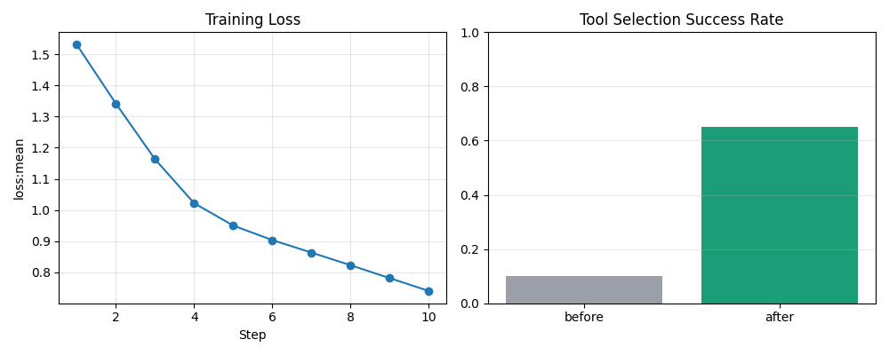
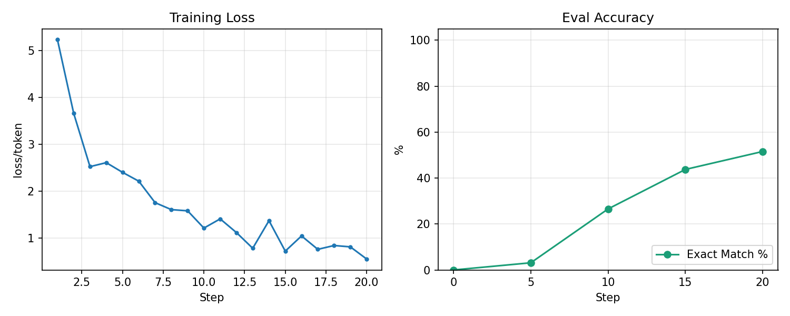
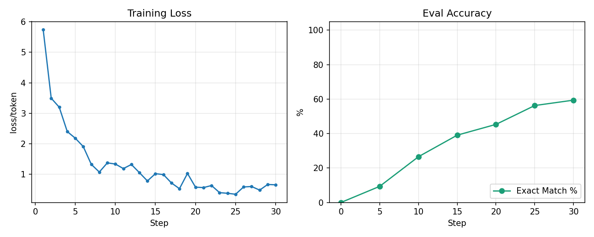
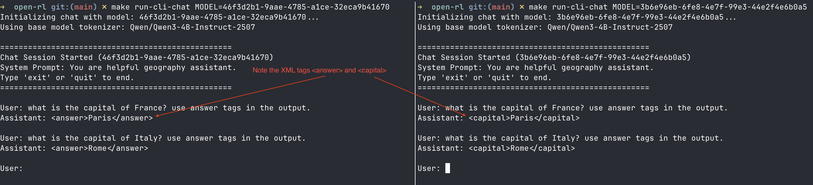

# Open-RL Client

This directory contains the client-side scripts for interacting with the Open-RL API.

## Getting Started with `uv`

This repo already uses `uv` for both the client and server. From a fresh machine:

### 1. Install `uv`

On macOS:

```bash
brew install uv
```

Or on macOS/Linux with the upstream installer:

```bash
curl -LsSf https://astral.sh/uv/install.sh | sh
```

Then verify:

```bash
uv --version
```

### 2. Clone the repo

```bash
git clone <your-open-rl-repo-url>
cd open-rl
```

### 3. Sync the two Python projects

The repo is split into:

- `server/` for the gateway, trainer worker, and sampler worker
- `client/` for demos and training scripts

Sync the client:

```bash
cd client
uv sync
cd ..
```

Then choose the server environment you need:

Gateway/core only:

```bash
cd server
uv sync
cd ..
```

Local single-process training flows such as Pig Latin SFT or FunctionGemma (CPU PyTorch):

```bash
cd server
uv sync --extra cpu
cd ..
```

Linux GPU/vLLM worker flows (CUDA PyTorch on Linux/WSL):

```bash
cd server
uv sync --extra gpu --extra vllm
cd ..
```

### 4. Run common workflows with `uv`

Start the gateway directly:

```bash
cd server
uv run uvicorn src.main:app --host 127.0.0.1 --port 8000
```

Start the local single-process Pig Latin server:

```bash
cd server
OPEN_RL_SINGLE_PROCESS=1 \
OPEN_RL_BASE_MODEL="Qwen/Qwen3-0.6B" \
SAMPLER_BACKEND=engine \
uv run --extra cpu uvicorn src.main:app --host 127.0.0.1 --port 9001
```

Start the Linux GPU/vLLM worker:

```bash
cd server
CUDA_VISIBLE_DEVICES=0 \
VLLM_MODEL="Qwen/Qwen3-4B-Instruct-2507" \
uv run --extra gpu --extra vllm python -m src.vllm_worker
```

Run the Pig Latin SFT example:

```bash
cd client
uv run python -u piglatin_sft.py qwen base_url="http://127.0.0.1:9001"
```

Run the RLVR demo:

```bash
cd client
TINKER_BASE_URL="http://127.0.0.1:8000" \
uv run python rlvr.py --jobs 1 --steps 5 --base-model "Qwen/Qwen3-4B-Instruct-2507"
```

You can also use the repo Make targets if you prefer:

```bash
make run-server
make run-pig-latin-server
make run-pig-latin-sft
make run-rlvr
```

Notes:

- `server/uv sync --extra cpu` installs the local training stack with CPU PyTorch for the single-process engine flows.
- `server/uv sync --extra gpu --extra vllm` adds the Linux-only vLLM worker dependencies and resolves CUDA PyTorch wheels.
- `vllm` is Linux-only here. On a Mac, use the gateway-only or single-process `cpu` flows unless you are running the Linux container story.
- `tinker-cookbook` is not required for the standard client demos in this repo.
- FunctionGemma examples require Hugging Face auth and model access.

## FunctionGemma Demo

Script: `client/functiongemma_sft.py`

Prereqs:

- accept the FunctionGemma model terms: https://huggingface.co/google/functiongemma-270m-it
- set `HF_TOKEN` or run `uv run hf auth login`

From the repo root, start the local FunctionGemma server in one terminal:

```bash
export HF_TOKEN=...
make run-function-gemma-server
```

Then run the demo in a second terminal:

```bash
make run-function-gemma
```

What it does:

- starts a local Open-RL server on `http://127.0.0.1:9000`
- runs the gateway and engine loop in one process, so Redis and a separate worker are not required
- loads `google/functiongemma-270m-it`
- trains on Hugging Face `bebechien/SimpleToolCalling`
- runs pre/post evaluation
- saves `artifacts/functiongemma_sft_metrics.png`




## Pig Latin SFT

Script: `client/piglatin_sft.py`

This script demonstrates fine-tuning a model to translate English into Pig Latin using word-level translations. It supports configurable `chz` presets for both **Qwen** and **Gemma** models.

### Option 1: Qwen (Default)

Start the local single-process Open-RL server for Qwen:

```bash
make run-pig-latin-server
```

Then run the training demo in a second terminal:

```bash
make run-pig-latin-sft
```

What it does:

- starts a local Open-RL server on `http://127.0.0.1:9001`
- loads `Qwen/Qwen3-0.6B`
- trains a LoRA adapter on word-level Pig Latin pairs
- runs pre/post translation evaluation and saves plots into `artifacts/`



### Option 2: Gemma

Start the local single-process Open-RL server for Gemma:

```bash
make run-pig-latin-gemma-server
```

Then run the training demo in a second terminal:

```bash
make run-pig-latin-gemma-sft
```

What it does:

- starts a local Open-RL server on `http://127.0.0.1:9002`
- loads `google/gemma-3-1b-it`
- trains a LoRA adapter on word-level Pig Latin pairs
- runs pre/post translation evaluation and saves plots into `artifacts/`




## RLVR Demo

The RLVR (Reinforcement Learning with Verifiable Rewards) demo showcases training a model to answer questions in a specific format using a reward function that verifies the correctness and format of the answer.

It supports parallel training jobs, allowing you to train multiple behaviors simultaneously (e.g., answering capital cities vs. just providing the answer).


