# Open-RL Server MVP: System Architecture & Design

This document summarizes the final architecture of the Open-RL API backend after refactoring it to a multi-tenant, batched "Clock Cycle" engine. The server is designed to emulate the behavior of high-throughput RL infrastructure while minimizing VRAM footprint via LoRA hot-swapping.

## High-Level Architecture

The API backend consists of two primary layers:
1. **The Asynchronous Gateway (FastAPI)**: Handles incoming HTTP requests from the Tinker SDK client, issues immediate future tracking IDs, and pushes workloads to a central asynchronous queue.
2. **The Clock Cycle Engine (PyTorch/PEFT)**: A continuous background engine that drains the global request queue, batches operations by model tenant (`model_id`), manages PyTorch hardware resources lock-step, and executes actual tensor math.

## Key Components

### 1. Asynchronous Request Queue & Polling
- **Problem**: Serving large LLMs synchronously via REST API (`asyncio.to_thread` directly inside HTTP handlers) causes catastrophic concurrency failures, OOM errors, and race conditions when multiple users hit endpoints simultaneously.
- **Solution**: The server utilizes an `asyncio.Queue()`. HTTP handlers simply append a payload to the queue and instantly return a `req_id`.
- **Latency & Long-Polling**: The client SDK leverages a `retrieve_future` polling mechanism. To avoid network spam, the server implements **long-polling**: it uses an `asyncio.Event` to wait up to **60 seconds** for the specific `req_id` to complete. If the result is ready within that window, it returns immediately. If the timeout is reached, it returns `{status: "pending"}`/`try_again` to keep the connection alive.

### 2. Multi-Tenant LoRA Architecture
- **Problem**: Loading a multi-billion parameter base model (e.g., Qwen 3) consumes ~10-20GB+ of VRAM. Hosting multiple specialized models concurrently is impossible on a standard GPU.
- **Solution (`peft`)**: The `TrainerEngine` initializes and statically anchors exactly **one** Base Model in VRAM. When a client calls `/api/v1/create_model`, the engine downloads an initial low-rank (e.g., Rank 16) adaptation layer (LoRA), mapping it uniquely to that client's `model_id` via `model.add_adapter()`.
- **GPU Residency & Hot-Swapping**: All adapter weights (typically 10-50MB) reside on the GPU in VRAM at all times alongside the massive base model. When switching between tenants, `engine.set_active_adapter()` does *not* move weights across the PCIe bus; it merely flips a logical pointer within PyTorch to route math through that specific tenant's dictionary of LoRA matrices.
- **Thread-safe Initialization**: A `threading.Lock()` securely forces parallel clients to wait while the Base Model physically loads into GPU memory. Subsequent simultaneous client joiners acquire the lock, recognize the base model is warm, and inject only their tiny LoRA layers.

### 3. The Clock Cycle Engine
- The engine operates an infinite `while True` loop (`clock_cycle_loop`) deployed as a background task. 
- It rests until it detects at least one item in the queue. Upon waking, it processes immediately to minimize latency, while still naturally grouping concurrently arriving network requests due to the async event loop mechanics.
- **Batched Execution**: It separates mixed incoming network requests by their originating `model_id`.
- **Single-Worker Race Condition Prevention**: Because there is only one worker pulling from the queue (the `clock_cycle_loop`), execution is perfectly sequential. This enforces a strict, isolated hardware timeline: `set_active_adapter` is invoked, and then `model.forward()`, `loss.backward()`, and `optimizer.step()` are executed atomically. If multiple workers were used, Tenant B could swap the active adapter in the middle of Tenant A's backward pass, poisoning the gradients.
- **Hardware Hot-Swapping Overhead**: It executes sequentially over each tenant group. Because it only executes `engine.set_active_adapter(model_id)` once per tenant batch, it drastically cuts down on the sluggish `peft` adapter switching overhead that occurs when interleaving single math operations.

### 4. Stateful Tensor Workloads
The `TrainerEngine` isolates math execution strictly by `model_id` to prevent gradient poisoning:
- **`model.train()` Semantics**: Rather than triggering a training loop, `.train()` merely flips the PyTorch execution graph into a training state, ensuring that dropout layers activate and gradient history is actively tracked in memory during forward passes.
- **`optimizers` dict**: Each tenant maintains its very own `torch.optim.AdamW` instance stored in a dictionary. Because optimizers like AdamW have "momentum" (remembering statistics about previous gradients), sharing an optimizer would cause Tenant A to mathematically poison Tenant B. The dictionary ensures Tenant A's math only updates Tenant A's adapter.
- **Sanitization & Clamping**: Explicit float-handling prevents `NaN` or `Infinity` from collapsing the JSON serialization. Variables like `.gather()` lengths, `-inf` logprobs, and `torch.exp()` overflow differences are precisely clamped to preserve mathematical stability.
- **Gradient Clipping**: `torch.nn.utils.clip_grad_norm_` explicitly checks for gradient explosions (`grad_norm=NaN`) before triggering `optimizer.step()`.

### 5. Unified Inference & Training sync
- By directing `/api/v1/asample` generation requests *through* the core clock cycle queue instead of resolving them immediately in the HTTP handlers, the server completely side-steps race conditions where inference adapter hot-swapping could occur in the middle of an in-flight backpropagation pass.

## v2: Multi-GPU Architecture (Implemented)

While the single-GPU MVP successfully emulates high-throughput production systems, Reinforcement Learning (e.g., GRPO) remains bound by generation speed. To scale throughput, we must physically separate training and inference across multiple GPUs using a dedicated inference engine like vLLM.

### 1. Split-Service Architecture
To completely bypass the Python Global Interpreter Lock (GIL) and prevent CPU bottlenecks between PyTorch and vLLM, the API Gateway will utilize Python `multiprocessing`:
- **Main Process (GPU 0 - Training)**: Runs the FastAPI Gateway and the existing PyTorch Clock Cycle Engine. Continues to handle `forward_backward` and `optim_step` batching.
- **Subprocess (GPU 1 - Inference)**: Runs a dedicated `vLLM` AsyncLLMEngine instance with `enable_lora=True` to handle high-speed generation.
- **IPC (Inter-Process Communication)**: The API Gateway routes the `prompt_token_ids` for `/api/v1/asample` requests to the vLLM subprocess via high-speed Unix Domain Sockets, completely isolating the CUDA contexts and maximizing VRAM stability.

### 2. LoRA Weight Synchronization
To scale generation speed without dragging down training latency, we must overcome the weight synchronization bottleneck between GPUs.
- **Base Model Permanence**: The massive base model (e.g. 10GB Qwen) is loaded once onto the Trainer GPU (PyTorch) and identically onto the Inference GPU (vLLM). It is never sent across the PCIe bus/NVLink, as syncing 10GB per training step would destroy throughput.
- **The NCCL/vLLM Challenge**: Theoretically, PyTorch's `torch.distributed.broadcast` (NCCL) could shoot the 50MB LoRA adapter weights directly from GPU 0 to GPU 1 in microseconds. However, vLLM utilizes a custom C++/CUDA backend and PagedAttention memory manager. You cannot safely overwrite raw tensor pointers from Python; it would require writing custom PyTorch-vLLM C++ bindings to catch the NCCL broadcast layer.
- **Network Drive Sync (`Filestore`)**: The standard high-throughput production alternative avoids physical SSD I/O while side-stepping the NCCL problem across separate physical worker nodes. The synchronization follows a strict pipeline:
  1. **Trainer Save**: When `save_weights_and_get_sampling_client` is called, the PyTorch engine (`engine.py`) reads `$OPEN_RL_TMP_DIR` (defaulting to `/tmp/open-rl` locally, or `/mnt/lustre/open-rl` in the distributed GKE cluster). It calls `model.save_pretrained()`, which instantly writes `adapter_config.json` and the ~30MB `adapter_model.safetensors` matrices.
  2. **Gateway Handoff**: The PyTorch Clock Cycle replies to the Gateway with the literal directory path (e.g., `/mnt/lustre/open-rl/peft/answer`), and the Gateway registers a new `sampling_session_id`.
  3. **vLLM Hot-Swap**: When the Gateway routes inference requests to the vLLM subprocess (`vllm_worker.py`), it forwards the `lora_path` over the network HTTP request. Because vLLM's internal cache mechanism strictly requires a positive 32-bit integer ID, `vllm_worker.py` hashes the tenant ID string (using `hashlib.md5`) to generate a stable `lora_int_id`. It constructs a dynamic `LoRARequest`, and vLLM's C++ backend streams the `.safetensors` files from the shared Filestore NFS drive directly into GPU 1's PagedAttention VRAM blocks in milliseconds.

### 3. Queue Management & Sync Barriers
Uncoupling inference from the central Clock Cycle queue re-introduces race conditions. A generation request could hit the Inference GPU *before* the synchronization step finishes updating vLLM's LoRA adapters.
- **The Solution (Sync Barrier)**: The gateway will maintain state locks per `model_id`. When a client triggers an adapter save, the gateway locks that tenant's inference endpoint. Generation requests for that tenant remain queued or pending until the new LoRA weights are fully committed to disk and successfully loaded by the vLLM engine.
### 4. Tokens-In, Tokens-Out Semantics (TITO)
When splitting RL into Trainer + Inference GPUs, you must prevent the API Gateway from decoding arrays into raw text strings (`"prompt": "What is..."`) to send to vLLM. 
- **The RL Logprob Problem**: Tokenizers are notorious for non-deterministic spacing and chunking. If vLLM receives a plain text string, it re-tokenizes it. Its resulting token array might be off by a single whitespace token compared to the Trainer's original encoding. When the Inference GPU returns its text, and the Trainer re-tokenizes it to calculate the `loss.backward()` advantages, the `targets` array will inevitably mismatch the `logits` sequence length or index alignment, entirely poisoning the RL gradients.
- **The Solution**: The system **must** communicate purely in integer arrays. The API Gateway routes `prompt_token_ids: [102, 345, ...] ` directly to vLLM. vLLM completely bypasses its internal tokenization and generates sequentially.
- **vLLM Support**: vLLM natively supports passing `prompt_token_ids` in its `v1/completions` OpenAI-compatible API (and its internal `AsyncLLMEngine`). It will return the generated output as an array of integer `token_ids` alongside the logprobs, ensuring perfect mathematical alignment when the Trainer GPU picks up the results for the backward pass.
