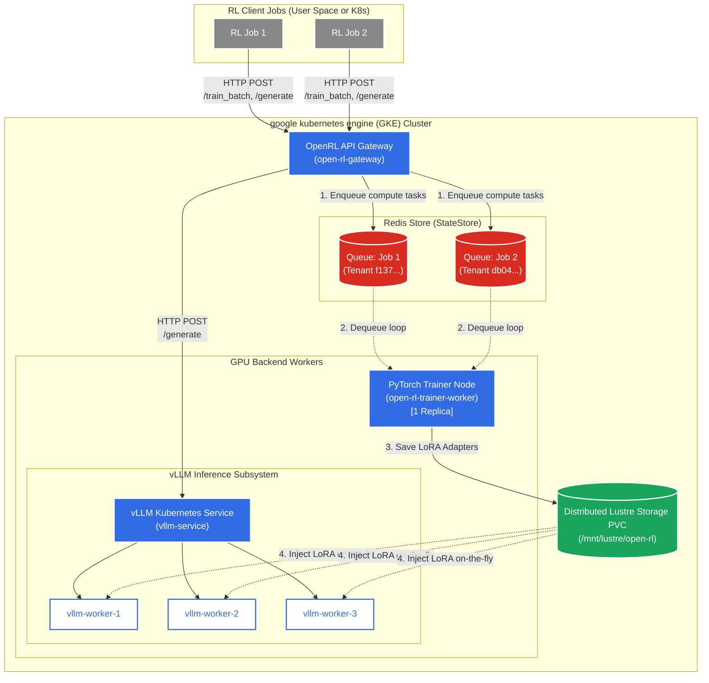

# Open-RL Server MVP: System Architecture & Design

This document summarizes the final architecture of the Open-RL API backend after refactoring it to a multi-tenant, batched "Clock Cycle" engine. The server is designed to emulate the behavior of high-throughput RL infrastructure while minimizing VRAM footprint via LoRA hot-swapping.

## High-Level Architecture

The API backend consists of two primary layers:
1. **The Asynchronous Gateway (FastAPI)**: Handles incoming HTTP requests from the Tinker SDK client, issues immediate future tracking IDs, and pushes workloads to a central asynchronous queue.
2. **The Clock Cycle Engine (PyTorch/PEFT)**: A continuous background engine that drains the global request queue, batches operations by model tenant (`model_id`), manages PyTorch hardware resources lock-step, and executes actual tensor math.

## Key Components

### 1. Asynchronous Request Queue & Polling
- **Problem**: Serving large LLMs synchronously via REST API (`asyncio.to_thread` directly inside HTTP handlers) causes catastrophic concurrency failures, OOM errors, and race conditions when multiple users hit endpoints simultaneously.
- **Solution**: The server utilizes an `asyncio.Queue()`. HTTP handlers simply append a payload to the queue and instantly return a `req_id`.
- **Latency & Long-Polling**: The client SDK leverages a `retrieve_future` polling mechanism. To avoid network spam, the server implements **long-polling**: it uses an `asyncio.Event` to wait up to **60 seconds** for the specific `req_id` to complete. If the result is ready within that window, it returns immediately. If the timeout is reached, it returns `{status: "pending"}`/`try_again` to keep the connection alive.

### 2. Multi-Tenant LoRA Architecture
- **Problem**: Loading a multi-billion parameter base model (e.g., Qwen 3) consumes ~10-20GB+ of VRAM. Hosting multiple specialized models concurrently is impossible on a standard GPU.
- **Solution (`peft`)**: The `TrainerEngine` initializes and statically anchors exactly **one** Base Model in VRAM. When a client calls `/api/v1/create_model`, the engine downloads an initial low-rank (e.g., Rank 16) adaptation layer (LoRA), mapping it uniquely to that client's `model_id` via `model.add_adapter()`.
- **GPU Residency & Hot-Swapping**: All adapter weights (typically 10-50MB) reside on the GPU in VRAM at all times alongside the massive base model. When switching between tenants, `engine.set_active_adapter()` does *not* move weights across the PCIe bus; it merely flips a logical pointer within PyTorch to route math through that specific tenant's dictionary of LoRA matrices.
- **Thread-safe Initialization**: A `threading.Lock()` securely forces parallel clients to wait while the Base Model physically loads into GPU memory. Subsequent simultaneous client joiners acquire the lock, recognize the base model is warm, and inject only their tiny LoRA layers.

### 3. The Clock Cycle Engine
- The engine operates an infinite `while True` loop (`clock_cycle_loop`) deployed as a background task. 
- It rests until it detects at least one item in the queue. Upon waking, it processes immediately to minimize latency, while still naturally grouping concurrently arriving network requests due to the async event loop mechanics.
- **Batched Execution**: It separates mixed incoming network requests by their originating `model_id`.
- **Single-Worker Race Condition Prevention**: Because there is only one worker pulling from the queue (the `clock_cycle_loop`), execution is perfectly sequential. This enforces a strict, isolated hardware timeline: `set_active_adapter` is invoked, and then `model.forward()`, `loss.backward()`, and `optimizer.step()` are executed atomically. If multiple workers were used, Tenant B could swap the active adapter in the middle of Tenant A's backward pass, poisoning the gradients.
- **Hardware Hot-Swapping Overhead**: It executes sequentially over each tenant group. Because it only executes `engine.set_active_adapter(model_id)` once per tenant batch, it drastically cuts down on the sluggish `peft` adapter switching overhead that occurs when interleaving single math operations.

### 4. Stateful Tensor Workloads
The `TrainerEngine` isolates math execution strictly by `model_id` to prevent gradient poisoning:
- **`model.train()` Semantics**: Rather than triggering a training loop, `.train()` merely flips the PyTorch execution graph into a training state, ensuring that dropout layers activate and gradient history is actively tracked in memory during forward passes.
- **`optimizers` dict**: Each tenant maintains its very own `torch.optim.AdamW` instance stored in a dictionary. Because optimizers like AdamW have "momentum" (remembering statistics about previous gradients), sharing an optimizer would cause Tenant A to mathematically poison Tenant B. The dictionary ensures Tenant A's math only updates Tenant A's adapter.
- **Sanitization & Clamping**: Explicit float-handling prevents `NaN` or `Infinity` from collapsing the JSON serialization. Variables like `.gather()` lengths, `-inf` logprobs, and `torch.exp()` overflow differences are precisely clamped to preserve mathematical stability.
- **Gradient Clipping**: `torch.nn.utils.clip_grad_norm_` explicitly checks for gradient explosions (`grad_norm=NaN`) before triggering `optimizer.step()`.