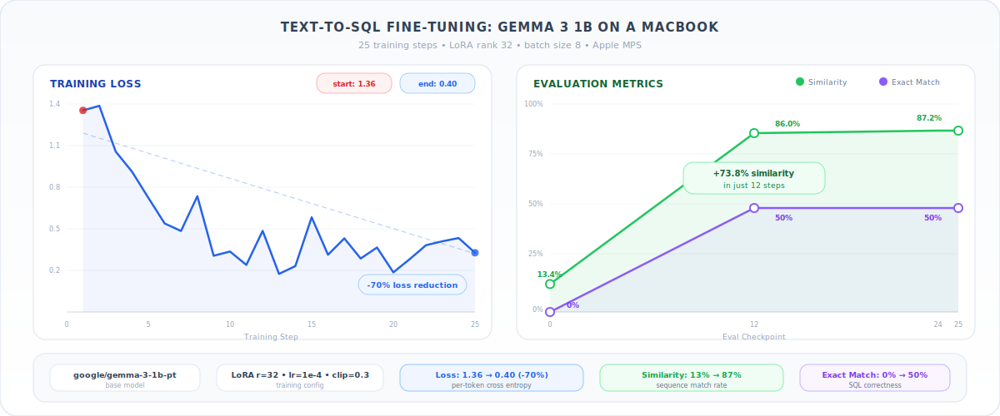

# From Your Mac to GKE: Fine-Tuning Gemma with Open-RL

RL fine-tuning is one of the most powerful ways to specialize language models — but the infrastructure behind it has traditionally been a nightmare. You're either wrestling with GPU allocation, rewriting training scripts for different backends, or managing job lifecycles by hand.

[Open-RL](https://github.com/google/open-rl) is a self-hosted, open-source API that makes this simple. Write your training loop once using the Tinker SDK, run it on your Mac to iterate fast, then point it at a GKE cluster when you're ready to scale. Same code, any backend.

Let's walk through it.

---

## Run It On Your Mac

You can fine-tune Gemma 3 1B on a Text-to-SQL task locally — no cloud, no GPUs, no setup beyond `pip install`. The server runs as a single process using Apple's MPS backend (or CPU).

Start the server:

```bash
OPEN_RL_SINGLE_PROCESS=1 SAMPLER_BACKEND=engine \
  OPEN_RL_BASE_MODEL="google/gemma-3-1b-pt" \
  uv run uvicorn src.main:app --host 0.0.0.0 --port 8000
```

Then write your training loop with the Tinker SDK — 4 API primitives are all you need:

```python
import tinker
from tinker import types

client = tinker.ServiceClient(base_url="http://localhost:8000")

# 1. Create a LoRA adapter on the base model
trainer = await client.create_lora_training_client_async(
    base_model="google/gemma-3-1b-pt",
    rank=32, train_mlp=True, train_attn=True,
)

# 2-3. Train: forward/backward pass, then optimizer step
for step in range(25):
    batch = get_next_batch(train_examples, batch_size=8)
    datums = [example["datum"] for example in batch]

    fwd = await trainer.forward_backward_async(datums, "cross_entropy")
    opt = await trainer.optim_step_async(
        types.AdamParams(learning_rate=1e-4, grad_clip_norm=0.3)
    )
    await asyncio.gather(fwd, opt)

# 4. Snapshot weights and evaluate
sampler = client.create_sampling_client(
    trainer.save_weights_for_sampler(name="step_25").result().path
)
result = sampler.sample(prompt_tokens, num_samples=1,
    sampling_params=types.SamplingParams(max_tokens=256, temperature=0.0))
```

That's the entire training loop. The Tinker SDK handles the rest — async request queuing, long-polling for results, weight snapshotting for evaluation. You focus on the training logic.

<p align="center">
  
</p>

In 25 training steps on a MacBook, Gemma 3 1B goes from 13% sequence similarity to 87% — with 50% exact match on SQL queries. Here are the real metrics:

<p align="center">
  
</p>

---

## Scale to GKE

Here's the key insight: **your client code doesn't change.** The Tinker API abstracts the infrastructure completely. To move from your Mac to a GKE cluster, you deploy the server components and change one URL.

```bash
# Deploy to GKE
kubectl apply -f server/kubernetes/distributed-shared/

# Port-forward to your local machine
kubectl port-forward svc/open-rl-gateway-service 8000:8000
```

Your training script still points at `localhost:8000` — but now the requests flow through a distributed system: a FastAPI gateway, a Redis queue, dedicated trainer and vLLM inference workers, and shared storage (Filestore or Lustre) for adapter persistence.

<p align="center">
  
</p>

This is what the Tinker API buys you. The same 4 primitives — `create_lora_training_client`, `forward_backward_async`, `optim_step_async`, `save_weights_for_sampler` — work identically whether the backend is a single process on your laptop or a multi-node Kubernetes cluster. You iterate locally, deploy to production, and never rewrite your training code.

---

## Why This Architecture Works

### Multi-Tenant LoRA

The traditional approach to running multiple fine-tuning jobs is to load a full model copy for each one. Three concurrent jobs on Gemma 3 1B means 3x the VRAM — ~30GB for three copies of a 10B parameter model.

Open-RL loads the base model into VRAM **once**. Each fine-tuning job gets a LoRA adapter — a small set of low-rank matrices (typically 10-50MB) that modify the model's behavior. Switching between tenants is a pointer flip via `peft.set_active_adapter()`, not a PCIe transfer. Three concurrent fine-tunes cost the base model + ~90MB of adapters instead of 3x the full model.

### Scheduling & Lifecycle Management

On GKE, these are solved problems. Kubernetes handles pod scheduling, restarts crashed workers, and scales resources. The Open-RL Clock Cycle Engine batches incoming requests by tenant, so multiple training jobs interleave efficiently on shared hardware without manual coordination.

No more "who's using the GPU?" Slack messages. No more SSH-ing into machines to restart crashed training runs. No more idle GPUs sitting between jobs.

### Shared Resources, Limitless Possibilities

Because the base model is shared and adapters are tiny, the marginal cost of adding another fine-tuning experiment is negligible. Instead of carefully planning one training run, you can run dozens of experiments in parallel — different hyperparameters, datasets, or reward functions.

The same infrastructure supports both supervised fine-tuning (SFT) and reinforcement learning with verifiable rewards (RLVR). Swap `"cross_entropy"` for `"importance_sampling"`, add a reward function, and you have an RL training loop.

---

## Get Started

- **[Text-to-SQL Notebook](../../client/texttosql_sft_notebook.ipynb)** — Fine-tune Gemma 3 1B locally, start to finish
- **[Pig Latin Notebook](../../client/piglatin_sft_notebook.ipynb)** — Simpler example to learn the API
- **[GKE Deployment Guide](../deployment.md)** — Set up the distributed backend on Kubernetes
- **[Architecture Deep Dive](../architecture.md)** — How the Gateway, Queue, and Clock Cycle Engine work together

Open-RL is Apache 2.0 licensed. Contributions welcome.
