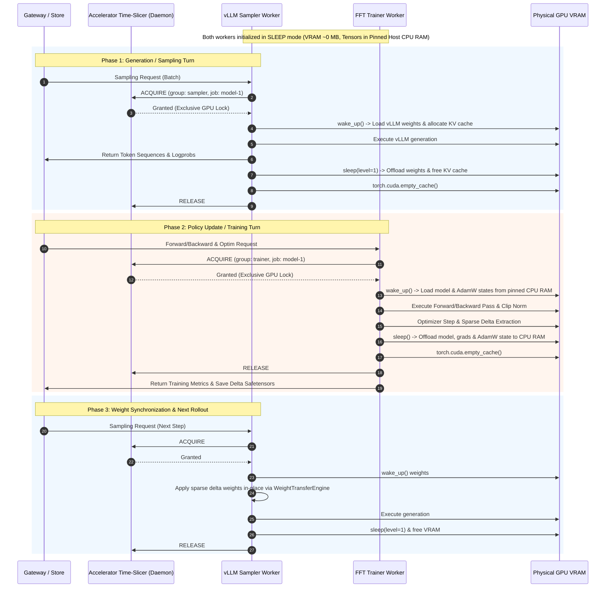

# Design Doc 008: Single-Node Shared GPU Coexistence for Training and Sampling (Dev Mode)

**Author:** Open-RL Engineering Team  
**Status:** Proposed Design (`v1.0.0`)  
**Target Component:** Gateway Server, `FFTTrainingWorker`, `vLLMInferenceEngine`, `SingleNodeTimeSlicer` (`accel_timeslicer`), K8s Dev Manifests  
**Target Manifests:** `k8s/deploy/single-node-dev/`, `src/accel_timeslicer/`, `src/server/`  

---

## 1. Executive Summary

In developer environments—such as local Linux workstations, remote single-GPU GCP instances (e.g., `b7`), or single-node Kubernetes development clusters—developers lack multi-GPU nodes or large multi-node clusters. 

Currently, production Open-RL Kubernetes manifests rely on multi-node node selectors, separate DRA `ResourceClaim` definitions for trainer and sampler workers, and cloud-specific high-throughput storage classes (`enterprise-rwx` / `lustre-storage-class`).

This design document establishes the architecture, lifecycle mechanics, memory budget controls, and manifest templates required to run Full Fine-Tuning (FFT) training and vLLM sampling concurrently on a **single GPU and single node** for dev-mode iterations.

---

## 2. Motivation & Problem Statement

### 2.1 Developer Reality vs. Multi-Node Production
* **Hardware Constraints**: Developers typically test on single-GPU instances (e.g., NVIDIA L4 24GB or A100/H100 80GB) where both training (forward/backward/optimizer) and sampling (vLLM inference) must co-exist.
* **Production Assumptions**: Production manifests in `k8s/deploy/distributed-fft-timeslice/` assume distinct node pools (`group.timeslice.io/trainers` vs `group.timeslice.io/samplers`), large multi-hundred-gigabyte RAM limits (`180Gi`), and dedicated cloud RWX storage classes.
* **OOM & Concurrency Collision**: If both Trainer and Sampler attempt to hold full GPU model weights and KV caches simultaneously on a 24GB/80GB GPU, CUDA Out-Of-Memory (OOM) crashes immediately occur.

### 2.2 Core Objectives
1. **Single GPU Coexistence**: Enable Trainer and Sampler workers to safely alternate execution on a single GPU without CUDA OOM errors.
2. **Fast Memory Offloading**: Guarantee zero VRAM footprint when a worker yields control by swapping model parameters, gradients, and optimizer states to pinned host CPU memory.
3. **Unified Single-Node K8s Profile**: Provide a clean `k8s/deploy/single-node-dev/` Kustomize manifest overlay for single-node Kubernetes deployments.
4. **Standalone Subprocess Mode**: Support lightweight local dev execution without Kubernetes dependencies (`OPEN_RL_WORKER_MANAGER=subprocess`).

---

## 3. High-Level Architecture

The single-node architecture uses the **Accelerator Time-Slicer** (`accel_timeslicer`) as a mutual-exclusion coordinator and pair it with **Host CPU Memory Offloading** (`sleep()` / `wake_up()`).

```text
                               ┌───────────────────────────────────────────────┐
                               │               Open-RL Gateway                 │
                               │        (Job Store / Queue Manager)            │
                               └──────────────────────┬────────────────────────┘
                                                      │
                                                      ▼
                               ┌───────────────────────────────────────────────┐
                               │           Single-Node Time Slicer             │
                               │       (Socket / TCP Daemon on Port 9753)      │
                               └───────────┬───────────────────────┬───────────┘
                                           │                       │
                       Acquire GPU Lock    │                       │ Acquire GPU Lock
                      ┌────────────────────┘                       └────────────────────┐
                      ▼                                                                 ▼
        ┌───────────────────────────┐                                     ┌───────────────────────────┐
        │    FFT Trainer Worker     │                                     │    vLLM Sampler Worker    │
        ├───────────────────────────┤                                     ├───────────────────────────┤
        │ 1. wake_up() (CPU -> GPU) │                                     │ 1. wake_up() (CPU -> GPU) │
        │ 2. Fwd/Bwd & Optim Step   │                                     │ 2. Sync Delta Weights     │
        │ 3. Compute Weight Delta   │                                     │ 3. Generate Tokens        │
        │ 4. sleep() (GPU -> CPU)   │                                     │ 4. sleep() (GPU -> CPU)   │
        └─────────────┬─────────────┘                                     └─────────────┬─────────────┘
                      │                                                                 │
                      ▼                                                                 ▼
        ┌───────────────────────────┐                                     ┌───────────────────────────┐
        │  Host CPU Memory Shadow   │                                     │  Host CPU Memory Shadow   │
        │ (Pinned RAM: Weights/Opt) │                                     │ (Pinned RAM: vLLM Engine) │
        └───────────────────────────┘                                     └───────────────────────────┘
                                           │                       │
                                           └───────────┬───────────┘
                                                       │ Alternate Access
                                                       ▼
                                      ┌─────────────────────────────────┐
                                      │       Single Physical GPU       │
                                      │       (e.g., L4 / H100)         │
                                      └─────────────────────────────────┘
```

---

## 4. Turn-Taking Execution Lifecycle

### 4.1 Sequence Diagram



---

## 5. Memory Offloading & VRAM Budget Analysis

### 5.1 Host CPU Memory Shadowing Mechanics

To ensure instantaneous turn switching without re-reading weights from storage disks:

1. **FFT Trainer Worker (`src/training/fft_trainer_worker.py`)**:
   - Maintains shadow buffers in pinned host CPU RAM (`pin_memory=True`).
   - During `sleep()`:
     - DMA copies parameters, gradients, and AdamW optimizer states from GPU VRAM to pinned CPU RAM via non-blocking CUDA streams.
     - Synchronizes CUDA stream (`torch.cuda.synchronize()`).
     - Replaces `.data` references with empty zero-size GPU storage (`torch.empty(0)`).
     - Calls `gc.collect()` and `torch.cuda.empty_cache()`.
   - During `wake_up()`:
     - Re-allocates CUDA tensors and non-blockingly copies pinned CPU buffers back to GPU VRAM.

2. **vLLM Sampler Worker (`src/server/vllm_sampler.py`)**:
   - Utilizes vLLM native `sleep(level=1)` API:
     - Offloads base model weights to CPU memory.
     - Destroys active KV cache memory pools.
   - Upon `wake_up(tags=["weights", "kv_cache"])`:
     - Restores weights and re-initializes KV cache allocation.

### 5.2 Single-GPU Memory Budget Breakdown (Example: Qwen2.5-0.5B on 24GB NVIDIA L4)

| State / Execution Phase | Trainer VRAM Usage | Sampler VRAM Usage | Pinned Host RAM Usage | Status on GPU |
| :--- | :--- | :--- | :--- | :--- |
| **Idle / Between Steps** | ~0.1 GB | ~0.1 GB | ~4.5 GB | Both Sleeping |
| **Sampling Active** | ~0.1 GB | **~8.5 GB** (vLLM + KV Cache) | ~4.5 GB | Sampler Holds GPU Lock |
| **Training Active** | **~12.2 GB** (Model + Grads + AdamW + Activation Checkpoints) | ~0.1 GB | ~4.5 GB | Trainer Holds GPU Lock |

*Result*: On a single 24GB L4 GPU, peak VRAM remains under 13 GB at all times, preventing OOM.

---

## 6. Required Changes for Dev Mode Single-Node Setup

### 6.1 Kubernetes Deployment: Manifest Overlay (`k8s/deploy/single-node-dev/`)

A new single-node Kustomize overlay collapses node selectors and configures local storage:

```yaml
# k8s/deploy/single-node-dev/kustomization.yaml
apiVersion: kustomize.config.k8s.io/v1beta1
kind: Kustomization

resources:
  - ../distributed-fft-timeslice

patches:
  # Patch PVC for single-node local storage
  - target:
      kind: PersistentVolumeClaim
      name: open-rl-shared-pvc
    patch: |-
      - op: replace
        path: /spec/storageClassName
        value: standard
      - op: replace
        path: /spec/resources/requests/storage
        value: 50Gi

  # Patch Trainer Worker Pod Template: set unified single nodeSelector
  - target:
      kind: ConfigMap
      name: open-rl-trainer-worker-pod-template
    patch: |-
      - op: replace
        path: /data/trainer-worker-pod.yaml
        value: |
          apiVersion: v1
          kind: Pod
          spec:
            restartPolicy: OnFailure
            containers:
            - name: trainer-worker
              image: ghcr.io/gke-labs/open-rl/server:latest
              imagePullPolicy: IfNotPresent
              command: ["uv", "run", "python", "-m", "server.training_requests_processor"]
              env:
              - name: REDIS_URL
                value: "redis://redis-service:6379"
              - name: OPEN_RL_ENABLE_FFT
                value: "true"
              - name: OPEN_RL_WEIGHT_SYNC_STRATEGY
                value: "delta"
              - name: OPEN_RL_ACCEL_TIMESLICER_HOST
                valueFrom:
                  fieldRef:
                    fieldPath: status.hostIP
              - name: OPEN_RL_ACCEL_TIMESLICER_PORT
                value: "9753"
              resources:
                limits:
                  memory: "32Gi"
                requests:
                  memory: "8Gi"
                  cpu: "2"
              volumeMounts:
              - name: shared-storage
                mountPath: /mnt/shared
            volumes:
            - name: shared-storage
              persistentVolumeClaim:
                claimName: open-rl-shared-pvc
            nodeSelector:
              group.timeslice.io/dev-node: "true"
```

### 6.2 Subprocess Mode (Non-Kubernetes VM / Local Machine)

For local dev without Kubernetes (`OPEN_RL_WORKER_MANAGER=subprocess`), the setup requires:

1. **Redis Server**:
   ```bash
   redis-server --daemonize yes --port 6379
   ```

2. **Accelerator Time-Slicer Daemon**:
   ```bash
   uv run python -m accel_timeslicer.serve \
     --listen-host 127.0.0.1 \
     --port 9753 \
     --backend llmd \
     --scheduling-policy lrs &
   ```

3. **Gateway Launch**:
   ```bash
   export OPEN_RL_WORKER_MANAGER="subprocess"
   export OPEN_RL_ENABLE_FFT="true"
   export REDIS_URL="redis://127.0.0.1:6379"
   export OPEN_RL_ACCEL_TIMESLICER_HOST="127.0.0.1"
   export OPEN_RL_ACCEL_TIMESLICER_PORT="9753"
   export CUDA_VISIBLE_DEVICES="0"

   uv run uvicorn server.gateway:app --host 0.0.0.0 --port 8000
   ```

---

## 7. Verification & Dev Workflow Integration

### 7.1 Development Makefile Target
Add a streamlined Makefile target to launch single-node dev runs:

```makefile
.PHONY: dev-single-node
dev-single-node: ## Run local single-node time-slicer & gateway in dev mode
	@echo "==> Starting local Redis..."
	@redis-cli ping >/dev/null 2>&1 || redis-server --daemonize yes
	@echo "==> Starting Accelerator Time-Slicer daemon..."
	@pkill -f "accel_timeslicer.serve" 2>/dev/null || true
	@uv run python -m accel_timeslicer.serve --listen-host 127.0.0.1 --port 9753 --backend llmd &
	@echo "==> Starting Gateway (Subprocess Mode)..."
	@OPEN_RL_WORKER_MANAGER=subprocess \
	 OPEN_RL_ENABLE_FFT=true \
	 REDIS_URL="redis://127.0.0.1:6379" \
	 OPEN_RL_ACCEL_TIMESLICER_HOST="127.0.0.1" \
	 OPEN_RL_ACCEL_TIMESLICER_PORT="9753" \
	 CUDA_VISIBLE_DEVICES=0 \
	 uv run uvicorn server.gateway:app --host 0.0.0.0 --port 8000
```

### 7.2 Validation Checklist
- [x] Trainer and Sampler acquire/release `time_slicer` locks without deadlock.
- [x] `FFTTrainingWorker.sleep()` completely clears GPU memory allocations.
- [x] vLLM Sampler successfully re-loads and applies sparse delta weights on wakeup.
- [x] Single 24GB/80GB GPU completes E2E test recipes (`make test e2e tiny-fft` / `fft-gsm8k-rl`).
