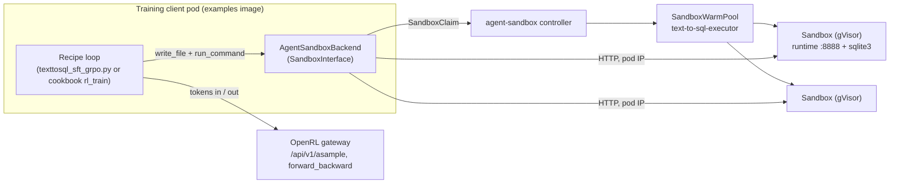

# Design Doc 013: Sandboxed Reward Execution for Text-to-SQL via agent-sandbox and tinker-cookbook

**Status**: Plan, approved for implementation
**Date**: 2026-09-09
**Depends on**: Design 012 (branch `docs/rl-environments-integration`) for the P1-P4 framing.

---

## 1. Summary

The Text-to-SQL recipe (`examples/text-to-sql`) executes model-generated SQL in-process with
`sqlite3`. That is acceptable for SQLite but it teaches the wrong habit: the reward is *execution of
untrusted model output*, and OpenRL users need to see how that composes with a real sandbox.

This plan delivers the showcase in two increments that share one piece of code:

1. **An agent-sandbox backend for tinker-cookbook's `SandboxInterface`**, living in
   `examples/common/` for now, upstreamed to tinker-cookbook later. The cookbook ships Modal and
   SandboxFusion backends; there is no Kubernetes backend. This closes that gap.
2. **Two consumers of that backend.**
   - **Phase A**: the existing Gemma 4 SFT+GRPO recipe gains an `executor=agent_sandbox` mode.
     Model-emitted SQL runs in a small pool of long-lived gVisor sandboxes claimed from a
     `SandboxWarmPool`. Same script, same curve, no cookbook dependency for the training loop.
   - **Phase B**: a tinker-cookbook `rl_train` recipe for Text-to-SQL on **Qwen3-1.7B**, where each
     prompt group claims its own sandbox in `EnvGroupBuilder.make_envs()` and releases it in
     `cleanup()`. This demonstrates that OpenRL runs cookbook recipes unmodified and that cookbook
     recipes gain Kubernetes sandboxing through the backend.

Decisions already taken: Qwen3 for the cookbook path (the cookbook has no Gemma renderer);
backend lands in `examples/` first; the v1alpha1 autoresearch manifest fix and the stale
Sandbox Fusion claims in `examples/README.md` are out of scope for this effort.

## 2. Facts that shape the design

| Fact | Consequence |
| --- | --- |
| agent-sandbox v1.0.1 (2026-09-03) is v1beta1 only; Python SDK `k8s-agent-sandbox` 1.0.1 on PyPI, `[async]` extra gives `AsyncSandboxClient` + `httpx` | Use `extensions.agents.x-k8s.io/v1beta1` `SandboxTemplate` / `SandboxWarmPool` / `SandboxClaim`; async client fits the recipe's asyncio loop |
| SDK data plane is an HTTP server in the sandbox image on `:8888` (`/execute`, `/upload`, `/download`); `SandboxInClusterConnectionConfig` talks to the pod IP with no router | We build a small runtime image; the training client must run in-cluster (or via the SDK's local-tunnel config for dev) |
| GKE cluster `open-rl-dra` has a `gvisor` RuntimeClass but no agent-sandbox CRDs | Phase 0 installs `sandbox-with-extensions.yaml` |
| Warm-pool claim latency measured upstream at ~2.6 s average, ~6 s max | Per-sample claims are wasteful (5,000+ per run); per-group claims (640 per run, 8 concurrent) cost ~3-6 s per step; a static pool costs nothing per step |
| cookbook 0.5.7 requires `tinker>=0.23.0`, `torch>=2.10`, `tml-renderers`; `SandboxInterface`, `Env`, `EnvGroupBuilder.cleanup()` are unchanged from 0.4.2 | Upgrade the cookbook now (§7); nothing in this plan depends on 0.4.2 |
| tinker SDK 0.25.0+ sends `forward_backward` as protobuf and refuses JSON `SampleResponse` / `ForwardBackwardOutput`; 0.23.0 and 0.24.1 pass the full core path against the current gateway (verified 2026-09-09) | Pin `tinker==0.24.1` with the cookbook upgrade; gateway protobuf support is a separate step (§7.2) |
| `ProblemEnv.check_answer` is synchronous | Phase B implements `Env` directly (single turn, ~50 lines) so `step()` can `await` the sandbox |
| `utils/rewards.py:run_sql` is used both to filter the dataset (trusted target SQL, thousands of calls) and to score predictions (untrusted) | Only prediction scoring moves into the sandbox; dataset filtering stays local. The trust boundary is model output, and the README says so explicitly |

## 3. Architecture



The sandbox never holds a Tinker credential (P2 in design 012). Egress from the sandbox is denied
by the template's network policy. Isolation is gVisor via `runtimeClassName`.

## 4. Components

### 4.1 Sandbox runtime image `open-rl/sql-executor`

- Base `python:3.12-slim`, non-root user, the reference runtime server from
  `agent-sandbox/examples/python-runtime-sandbox/main.py` (FastAPI `/execute`, `/upload`,
  `/download`, `/list`, `/exists` on 8888), plus `/opt/run_sql.py`.
- `run_sql.py` reads `schema.sql` and `query.sql` from the working directory, runs
  `executescript(schema)` then `execute(query)` in an in-memory database with the same 250 ms
  progress-handler deadline the recipe uses today, and prints `{"rows": [...], "error": null}` as
  JSON. Float rounding matches `utils/rewards.py:run_sql` so results are byte-comparable.
- Built by Cloud Build alongside the other images (`cloudbuild.yaml`), tagged per release.

### 4.2 Kubernetes resources (`k8s/deploy/agent-sandbox/` or `examples/text-to-sql/k8s/`)

- `SandboxTemplate text-to-sql-executor`: `runtimeClassName: gvisor`, `runAsNonRoot`, requests
  250m / 256Mi, port 8888, `networkPolicy` with ingress only from the training-client namespace
  and **no egress rules** (deny all), `envVarsInjectionPolicy: Disallowed`.
- `SandboxWarmPool text-to-sql-executor`: `replicas: 4` for Phase A, `replicas: 8` for Phase B
  (one per prompt in a step).
- RBAC: a Role granting the client service account create/get/list/watch/delete on
  `sandboxclaims.extensions.agents.x-k8s.io` and get/list/watch on `sandboxes.agents.x-k8s.io`,
  bound to `open-rl-sa` (reused from the shared backend stack).
- A `Job` manifest that runs the recipe in-cluster from the examples image so pod IPs are
  reachable. Dev path: the SDK's `SandboxLocalTunnelConnectionConfig` with `kubectl port-forward`.

### 4.3 `examples/common/agent_sandbox.py` (the reusable piece)

```python
class AgentSandboxBackend:                       # satisfies tinker_cookbook SandboxInterface
    @classmethod
    async def create(cls, *, warm_pool: str, namespace: str, ready_timeout: int = 180,
                     connection=SandboxInClusterConnectionConfig()) -> "AgentSandboxBackend": ...
    @property
    def sandbox_id(self) -> str: ...             # claim name
    async def run_command(self, command, workdir=None, timeout=60, max_output_bytes=None) -> SandboxResult
    async def read_file(self, path, max_bytes=None, timeout=60) -> SandboxResult
    async def write_file(self, path, content, executable=False, timeout=60) -> SandboxResult
    async def send_heartbeat(self, timeout=30) -> None   # status() probe; no-op keepalive today
    async def cleanup(self) -> None               # delete the claim

class AgentSandboxPool:                          # Phase A: N long-lived sandboxes, leased round-robin
    async def __aenter__(self) / __aexit__(self)  # claim N on enter, cleanup all on exit
    async def lease(self) -> AsyncIterator[AgentSandboxBackend]   # bounded by a semaphore

async def run_sql_in_sandbox(sb: SandboxInterface, context: str, query: str) -> tuple[rows | None, str | None]:
    # write_file schema.sql + query.sql into a per-call temp dir, run_command python /opt/run_sql.py, parse JSON
```

Behavior details: `run_command` maps `ExecutionResult(stdout, stderr, exit_code)` to
`SandboxResult`; `workdir` is honored by prefixing `cd`; `max_output_bytes` truncates client-side;
a claim that goes non-Ready raises `SandboxTerminatedError`. Unit tests use a fake HTTP server;
one integration test runs against kind with the controller installed.

### 4.4 Phase A: existing recipe (`examples/text-to-sql`)

- New chz group `reward: RewardConfig(executor="local" | "agent_sandbox", warm_pool, namespace,
  pool_size=4, connection="in_cluster" | "local_tunnel")`. Default stays `local` so laptop runs are
  unchanged.
- `score_prediction` gains an injectable executor callable. `build_rollout` and
  `sample_eval_metrics` become async-aware and go through `AgentSandboxPool.lease()` when the
  sandbox executor is selected. Dataset filtering (`build_dataset_rows`) keeps calling local
  `run_sql`.
- New per-step metrics: `sandbox_exec_p50_ms`, `sandbox_exec_p95_ms`, `sandbox_errors`.
- Kustomize overlay adds the template, warm pool, RBAC, and Job to the existing
  `examples/text-to-sql/kustomization.yaml` stack.

### 4.5 Phase B: cookbook recipe (`examples/text-to-sql/cookbook/`)

- `data.py`: `TextToSqlDatasetBuilder(RLDatasetBuilder)` wrapping `utils.rewards.load_dataset_splits`;
  `RLDataset.get_batch(i)` returns `groups_per_batch` `TextToSqlGroupBuilder`s.
- `env.py`:
  - `TextToSqlEnv(Env)`: `initial_observation` renders the existing plain prompt through the
    `qwen3_disable_thinking` renderer as a single user message; `step` parses the response, cleans
    SQL, awaits `run_sql_in_sandbox`, scores with `utils.rewards.score_prediction`, returns
    `StepResult(reward, episode_done=True, ...)`. Metrics mirror the existing ones
    (`compile`, `execution_match`, `exact_match`, `similarity`).
  - `TextToSqlGroupBuilder(EnvGroupBuilder)`: `make_envs` claims **one sandbox per group** via a
    `sandbox_factory`, writes `schema.sql` once, returns `group_size` envs sharing it; `cleanup`
    deletes the claim. `logging_tags` returns `["text_to_sql"]`. Pickleable: holds only the row
    and the factory reference.
- `train.py`: chz `CLIConfig` in the style of `recipes/math_rl/train.py`:
  `model_name=Qwen/Qwen3-1.7B`, `renderer_name=qwen3_disable_thinking`, `group_size=8`,
  `groups_per_batch=8`, `max_tokens=96`, `loss_fn=importance_sampling`, `learning_rate=1e-5`,
  `lora_rank=32`, `save_every=0` (OpenRL checkpoint limitation, issue #83), `base_url` from
  `TINKER_BASE_URL`. `sandbox_factory` is injected exactly as `harbor_rl` does it. On cookbook
  0.5.7 also set `rollout_error_tolerance=MinViableGroup()` so one failed sandbox claim does not
  kill a whole prompt group, and `termination.grader_timeout_seconds` to bound a hung executor.
- Server side: OpenRL deployed with `BASE_MODEL=Qwen/Qwen3-1.7B` (the tinker-cookbook example
  already documents this on two L4s).

## 5. Phases, deliverables, acceptance

| Phase | Deliverables | Acceptance |
| --- | --- | --- |
| **0a. Client upgrade** (§7.1) | `examples/pyproject.toml`: `tinker-cookbook==0.5.7`, `tinker==0.24.1`; regenerate `docs/tinker-client-compatibility.md`; rerun the existing Gemma recipe and the cookbook `shorter` RL example | Compatibility report shows the same 41 supported methods; text-to-SQL `phase=full` curve unchanged within noise |
| **0b. Cluster prereqs** | agent-sandbox v1.0.1 with extensions on `open-rl-dra`; `sql-executor` image in Cloud Build; template + warm pool + RBAC applied | `kubectl get sandboxwarmpools` shows `readyReplicas == replicas`; a manual claim can `run_command("python /opt/run_sql.py")` |
| **1. Backend** | `examples/common/agent_sandbox.py`, unit tests, kind integration test | `isinstance(backend, SandboxInterface)` is true; write/run/read round trip passes; cleanup deletes the claim |
| **2. Phase A** | `executor=agent_sandbox` in the Gemma recipe; Job overlay; metrics | `phase=full` on GKE reproduces the known-good curve (execution match in the 35-45% band at step 80) with all prediction scoring in sandboxes; p95 exec latency table in the README |
| **3. Phase B** | `examples/text-to-sql/cookbook/` recipe; Qwen3 server overlay | Execution match rises monotonically over 40+ steps from the Qwen3 baseline; one claim per group visible in `kubectl get sandboxclaims -w` |
| **4. Docs** | README section in `examples/text-to-sql`; `docs/sandboxed-rewards.md` guide with the §3 diagram and the trust-boundary explanation; note the upstream contribution plan | Docs reviewed; commands copy-paste clean from a fresh cluster |

Suggested order: 0a, 0b, 1, 2, 3, 4. Phase 1 and the image in Phase 0b can proceed in parallel.
Gateway protobuf support (§7.2) is independent of all of them and can land whenever the server
team has capacity.

## 6. Risks and open items

- **In-cluster only for the default path.** Pod IPs are not routable from a laptop. Mitigation:
  document the local-tunnel connection config for dev; the Job overlay is the supported path.
- **Headless-service DNS fallback.** `SandboxInClusterConnectionConfig` falls back to
  `<sandbox>.<ns>.svc.cluster.local`, which requires the template's `service` flag. Verify the
  default in v1.0.1 during Phase 0 and set it explicitly if needed.
- **Claim latency in Phase B.** ~3-6 s per step for 8 concurrent claims is acceptable for a demo but
  should be logged; if it dominates, switch the group builder to lease from a pool instead of
  claiming. Keep the choice behind one flag.
- **SDK dependency weight.** `k8s-agent-sandbox[async]` pulls `kubernetes`, `kubernetes_asyncio<34`,
  `httpx`, `prometheus-client`. Add as an optional extra `[sandbox]` in `examples/pyproject.toml`
  so laptop users without a cluster are not affected.
- **transformers override.** `examples/pyproject.toml` forces `transformers>=5.7.0` (added in
  #81 for the Gemma guide) while cookbook 0.5.7 declares `<=5.5.4`. The override wins at resolve
  time, so the cookbook runs on a transformers it was not tested with. The Qwen3 renderer only
  needs the tokenizer, and the render check in §7.3 passed on 5.5.4; rerun that check against the
  resolved version as part of Phase 0a.
- **Upstreaming.** When contributing to tinker-cookbook, the backend should register as a
  `SandboxBackend.AGENT_SANDBOX` value and add a `_check_with_agent_sandbox` branch in
  `recipes/code_rl/code_grading.py` so `code_rl` gains it too. Out of scope here, but the module
  layout should not make it harder.

## 7. Client upgrade: tinker-cookbook 0.5.7 and the tinker SDK

### 7.1 Do now: cookbook 0.5.7 with tinker pinned to 0.24.1

Verified on 2026-09-09 by running `tests/tinker_client_compat.py` against the current gateway with
each SDK version (Linux box; the fixture needs `/dev/shm`):

| tinker | Result against current gateway |
| --- | --- |
| 0.22.7 (pinned) | 41 supported, baseline |
| 0.23.0, 0.24.1 | Same 41 supported; 5 new SDK methods unsupported (`whoami`, `get_billing_usage*`, `export_session_trace*`), none on the training path |
| 0.25.0 through 0.27.2 | `forward_backward`, `sample`, `compute_logprobs` and everything downstream fail (see §7.2) |

Cookbook 0.5.7 requires `tinker>=0.23.0`, so `tinker==0.24.1` satisfies it. Costs of the cookbook
bump: `torch>=2.10` (examples venv has 2.12 already), a new `tml-renderers` dependency used only for
Inkling tokenizers, and the transformers override caveat in §6. There are no breaking changes for
code that subclasses `Env`, `EnvGroupBuilder`, or `ProblemEnv`; `rl_train.Config` adds
`termination` and widens `rollout_error_tolerance` to accept `None`. Custom `TokenCompleter`
subclasses must accept a `max_tokens` keyword. Also note that `training_client.get_tokenizer()` is
no longer called by `rl_train`; the tokenizer is loaded from Hugging Face by model name.

### 7.2 Do later: protobuf on the gateway to unlock tinker 0.25+

From 0.25.0 the SDK:

- POSTs `/api/v1/forward_backward` with a protobuf body and `Content-Type: application/x-protobuf`,
  unconditionally. With the `proto_compress_fwdbwd` client-config flag it also sets
  `Content-Encoding: zstd`. There is no JSON fallback. The current gateway returns a validation
  error and the SDK times out.
- Sends `Accept: application/x-protobuf` on `/api/v1/retrieve_future` for `SampleResponse` and
  `ForwardBackwardOutput`, and raises if the body comes back as JSON. Other response types stay JSON.
- Optionally batch-polls `/api/v1/retrieve_futures` when the server sets
  `sample_use_retrieve_futures` in `/api/v1/client/config`. The gateway does not set it, so this
  is not required.

The schema and converters ship in the SDK wheel (`tinker/proto/tinker_public_pb2.py`,
`request_conv.py`, `response_conv.py`), so the gateway can import them rather than vendor a
`.proto`. Work: decode protobuf `forward_backward` requests (with optional zstd) into the existing
dict shape, encode the two response types as protobuf when the request carries the `Accept`
header, keep the JSON paths for older SDKs, and extend `tests/tinker_client_compat.py` to run
under both a JSON-era and a proto-era SDK. Track separately from this design.

### 7.3 Renderer changes in 0.5.7 that affect training

Rendered with the Qwen3-1.7B tokenizer, one user message and one assistant answer, checked
against `apply_chat_template`:

| Renderer | 0.4.2 | 0.5.7 | Effect |
| --- | --- | --- | --- |
| `qwen3_disable_thinking` | prompt 33 tokens, 7 trained, matches HF | identical | None for this plan |
| `qwen3` (thinking on), assistant turn without reasoning | 7 trained, no think block | 11 trained, includes `<think>\n\n</think>\n\n` | 0.5.7 matches what the HF template writes on a produced turn; 0.4.2 taught the model to skip the block |
| Quoted `<|im_end|>` inside message text | becomes a real turn boundary (4 control tokens in the example) | stays literal text (2) | Fixes a training-data injection path (#886) |

Other 0.5.7 changes with training impact, from the upstream commits between the releases:

- **Loss withheld from the generation-prompt prefill** (`20d06ac8`). Renderers whose prompt ends
  in an open `<think>` (`qwen3_5`, `kimi_k25`, `nemotron3`, `deepseekv3_thinking`) trained the
  model on a token it is always given. Tokens are unchanged, only weights move. Qwen3 was already
  correct. **`examples/harvey_labs` trains Qwen3.5-9B and is affected**; expect a small loss shift
  and re-baseline before comparing curves across the upgrade.
- **Reasoning-off renderers now raise** when a supervised turn contains reasoning (`ab78b73f`)
  instead of silently training the reasoning. SFT datasets with `<think>` content used with a
  `*_disable_thinking` renderer will fail fast after the upgrade.
- **Qwen3.5 boundary and content trimming fixes** (`798a63ec`, #852). Also relevant to harvey_labs.
- **`role_colon` parse no longer strips whitespace**; it removes exactly the rendered prefix and
  suffix so render and parse are inverses. Reward code that relied on stripped content should strip
  itself.
- **`build_supervised_examples` splits multi-turn conversations** into one example per assistant
  turn instead of raising `NotImplementedError`.
- New renderer names: `qwen3_8_*`, `glm5_3_*`, `nemotron3*_preserve_thinking`, `tml_v0`. Still no
  Gemma renderer.

## 8. Non-goals

- No OpenRL server changes. The gateway, trainer, and sampler are untouched.
- No P3 (harness inside the sandbox). That needs the OpenAI-compatible endpoint from design 012 §7.2.
- No Substrate integration. It is gRPC-only with no Python SDK, no exec API, and is self-described
  as not production ready. Revisit when actor forking from a checkpoint lands.
- No Gemma renderer for the cookbook. Tracked separately as a possible upstream contribution.
