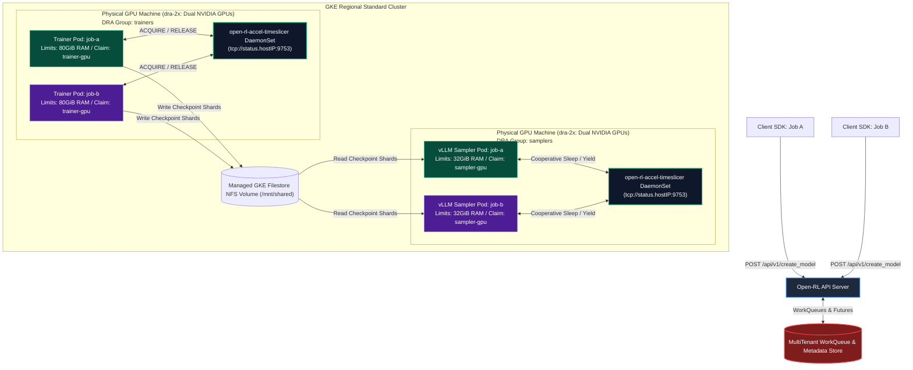
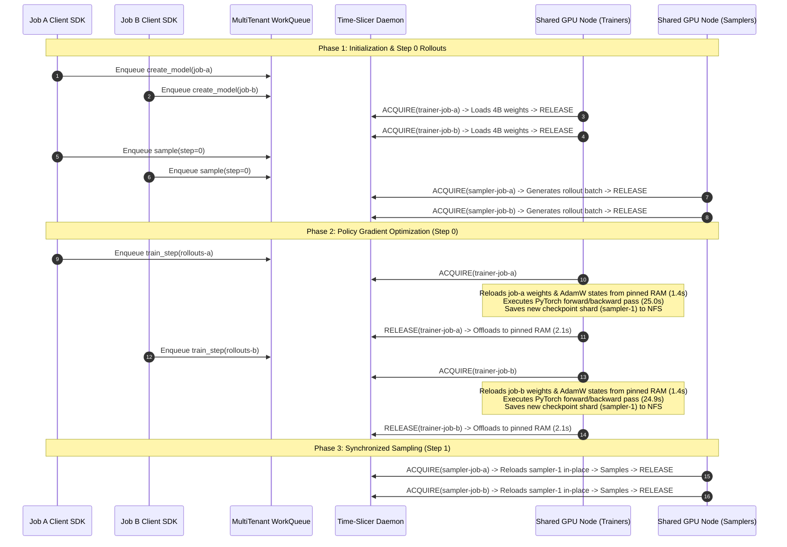

# Full Parameter Fine-Tuning (FFT) Architecture & Implementation Guide

This document provides a comprehensive technical deep-dive into the multi-tenant Full Parameter Fine-Tuning (FFT) and Reinforcement Learning (RL) architecture in Open-RL. It consolidates cluster topology, pod placement, dynamic weight swapping, control plane decoupling, hardware time-slicing, workload profiling, and empirical benchmark verifications into a single authoritative reference.

---

## 1. Problem Statement & Key Challenges

In large language model (LLM) Reinforcement Learning algorithms (such as GRPO, PPO, and REINFORCE), the execution loop alternates continuously between two distinct hardware-intensive phases:
1. **Rollout Generation (Sampling):** Generating large batches of token trajectories across hundreds of prompt inputs using an inference-optimized runtime (e.g., vLLM or TensorRT-LLM).
2. **Policy Gradient Optimization (Training):** Computing forward passes, advantage-weighted backpropagation, and multi-tensor momentum updates using an autograd engine (e.g., PyTorch FSDP).

### LoRA vs. Full Fine-Tuning (FFT)
When training lightweight **LoRA** adapters, only a tiny fraction (~0.1% to 1%) of the total model weights are updated. Inference engines like vLLM support Multi-LoRA runtime injection, allowing a single static serving cluster to dynamically swap low-rank matrices without altering the frozen base model weights in VRAM.

In contrast, **Full Parameter Fine-Tuning (FFT)** modifies 100% of the base model weights at every training step. Serving engines cannot natively mutate or reload multibillion-parameter weight matrices in-place while serving concurrent requests. 

### The Hardware Utilization Bottleneck
Maintaining separate, dedicated GPU clusters for training and sampling leads to severe hardware underutilization:
* While Samplers generate rollouts, expensive Trainer GPUs sit 100% idle.
* While Trainers compute gradient steps, inference GPUs sit 100% idle.
* Holding full 16-bit model parameters, 16-bit gradients, 32-bit AdamW momentum states (`exp_avg`, `exp_avg_sq`), and large KV caches simultaneously in VRAM exceeds single-GPU memory boundaries even for modest models (~4B+ parameters).

Open-RL solves this by implementing a **consolidated multi-tenant hardware time-slicing architecture**, enabling multiple concurrent RL experiments to share physical GPUs without virtualization overhead or memory corruption.

---

## 2. High-Level Cluster Topology & Pod Placement Architecture

Open-RL decouples policy gradient computation (Trainers) from rollout generation (Samplers) using asynchronous MultiTenant WorkQueues, while co-locating workloads onto regional Kubernetes GPU nodes governed by a node-local accelerator time-slicer daemon.



### Strict Role Segregation via `nodeSelector`
To prevent heavy PyTorch autograd compilations from interfering with latency-sensitive vLLM inference kernels, pod templates enforce explicit hardware boundaries using Kubernetes label selectors:
* **Trainers:** Configured with `nodeSelector: timeslice.io/group: trainers`, binding pods exclusively to nodes running trainer-scoped time-slicer instances.
* **Samplers:** Configured with `nodeSelector: timeslice.io/group: samplers`, confining rollout engines to dedicated inference nodes.

---

## 3. Control Plane & Data Plane Decoupling (Lifecycle Management)

Open-RL segregates operations into a **Control Plane** (infrastructure provisioning, worker lifecycles) and a **Data Plane** (training step computation, token sampling) to guarantee zero-drop request drainage and fail-safe scalability.

```
[Control Plane Operations]
API Server Control Queue (open_rl:worker_launch_queue) ---> WorkerLaunchProcessor (launches/gracefully stops PIDs)

[Data Plane Operations]
API Server Data Queues (queue:<model_id>, sampler_queue:<model_id>) ---> Workers (runs steps/computes tokens)
```

### Queue Division & Protocols
| Plane | Operation | Protocol / Redis Key | Consumer |
| :--- | :--- | :--- | :--- |
| **Control Plane** | `create_model` (Launch trainer) | `open_rl:worker_launch_queue` (Central) | `WorkerLaunchProcessor` |
| **Control Plane** | `launch_sampler` (Launch sampler) | `open_rl:worker_launch_queue` (Central) | `WorkerLaunchProcessor` |
| **Control Plane** | `delete_model` (Stop workers) | `open_rl:worker_launch_queue` (Central) | `WorkerLaunchProcessor` |
| **Control Plane** | `create_sampling_session` | Registry Metadata Key (Redis) | API Server |
| **Data Plane** | `forward_backward`, `optim_step` | `open_rl:queue:<model_id>` (Isolated) | PyTorch Trainer Worker |
| **Data Plane** | `save_weights_for_sampler` | `open_rl:queue:<model_id>` (Isolated) | PyTorch Trainer Worker |
| **Data Plane** | `sample`, `asample` | `open_rl:sampler_queue:<model_id>` (Isolated) | vLLM Sampler Worker |

### Provisioning & Activation Mechanics
* **Trainer Provisioning:** When `/api/v1/create_model` is invoked, the API Server enqueues a launch command. `WorkerLaunchProcessor` pops the request and invokes `FFTWorkerManager.launch_trainer(model_id)` to provision the pod or subprocess.
* **Sampler Provisioning:** When `/api/v1/create_sampling_session` is invoked, `WorkerLaunchProcessor` invokes `FFTWorkerManager.launch_sampler(model_id)`. The sampler compiles CUDA graphs and posts `open_rl:sampler_ready:<model_id> = "1"` to Redis. The API Server polls this key, blocking session return until physical readiness is verified.

### Graceful Queue-Based Teardown (Sentinel Pattern)
To prevent dropping in-flight rollouts during de-provisioning, teardown uses the **Sentinel Pattern**:
1. When `/api/v1/delete_model` is invoked, the API Server enqueues a `shutdown_workers` command to `open_rl:worker_launch_queue`.
2. `WorkerLaunchProcessor` enqueues a **Shutdown Sentinel (Poison Pill)** (`{"request_id": "SHUTDOWN_SENTINEL"}`) to the tails of both the trainer (`queue:<model_id>`) and sampler (`sampler_queue:<model_id>`) FIFO data queues.
3. Workers continue popping and processing pending tasks. Upon popping the sentinel, they halt polling, complete active asyncio tasks, unregister from the time-slicer daemon, and exit gracefully.

---

## 4. Core Components & Deep Interaction Analysis

### A. API Server (`open-rl-gateway`)
The API Server acts as the central REST API facade and orchestration controller. It receives incoming client SDK requests (`create_model`, `create_sampling_client`, inference rollouts, and training steps), validates session payloads, and routes execution tasks into MultiTenant WorkQueues. While hosted inside the same OS process as the worker manager in the current implementation, architecturally it remains a distinct, decoupled request controller.

### B. Kubernetes Worker Manager (`KubernetesFFTWorkerManager`)
The Worker Manager is the cluster provisioning engine responsible for pod lifecycle management, instantiated when `OPEN_RL_WORKER_MANAGER=kubernetes`.
* **Dynamic Pod Provisioning:** Instead of relying on static Kubernetes Deployments, the manager dynamically provisions dedicated worker pods (`open-rl-trainer-<job-id>` and `open-rl-sampler-<job-id>`) per tenant workload upon demand.
* **Template Caching & Runtime Overrides:** At startup, `__init__` caches YAML pod templates mounted from ConfigMaps (`/etc/open-rl/trainer/trainer-worker-pod.yaml`). During pod creation, `render_pod()` injects runtime environment overrides (such as `OPEN_RL_WORKER_IMAGE`), ensuring new workers inherit updated container builds dynamically.

### C. MultiTenant WorkQueue (`RequestStore`)
To prevent multi-tenant head-of-line blocking, Open-RL replaces FIFO request processing with round-robin work queues. Each tenant model receives an isolated WorkQueue backed by Redis. Worker processes pop execution tasks asynchronously, posting telemetry and response payloads back into Redis `APIFuture` channels.

### D. Metadata Store (`RequestStore` / Redis Backend)
In addition to task queuing, Open-RL utilizes a centralized Metadata Store to maintain session definitions, tenant identifiers, active worker-provisioning status, and asynchronous request/response execution payloads. Today, Redis serves a dual architectural role—backing both the `MultiTenant WorkQueue` and the `Metadata Store`. Abstracting the Metadata Store as a distinct architectural component allows future scalability, enabling structured metadata persistence in relational databases (e.g., PostgreSQL) or distributed key-value stores while keeping high-throughput execution queuing in Redis.

### E. Accelerator Time-Slicer DaemonSet (`open-rl-accel-timeslicer`)
Running as a `hostNetwork: true` DaemonSet across GPU nodes, the time-slicer serializes CUDA execution within workload groups (`trainers` vs. `samplers`) by coordinating application-level memory offloading with external process snapshotting.
* **Cooperative Sleep & Snapshotting:** When a worker yields its time slice (`RELEASE(workload)`), it first performs an application-level sleep to offload active GPU memory to system CPU RAM. Once offloaded, the daemon invokes its `llm-d` backend (`LlmDCheckpointRestorer`) to checkpoint residual VRAM pages and freeze the execution context.
* **Restore & Wakeup:** When a workload is granted GPU access (`ACQUIRE(workload)`), `llm-d` restores the process context on the accelerator. The worker then executes an application-level wakeup to reload its model weights and optimizer states back into GPU VRAM before resuming execution.

### F. FFT PyTorch Trainer Worker (`fft_trainer_worker.py`)
The trainer executes PyTorch FSDP policy gradient optimization and coordinates directly with the time-slicer during context handoffs:
* **`sleep()`:** Before triggering time-slice release, the trainer iterates across model parameters and AdamW optimizer momentum dictionaries (`exp_avg`, `exp_avg_sq`), transferring CUDA tensors to pinned CPU host memory (`v.to("cpu").pin_memory()`) and clearing CUDA cache allocators.
* **`wake_up()`:** After time-slice acquisition, the trainer asynchronously pushes pinned CPU tensors back across PCIe lanes into target GPU devices, restoring active training state.

### G. vLLM Dynamic Sampler Worker (`vLLM Worker`)
The sampler runs an inference engine wrapped around vLLM Dynamo and implements **cooperative sleep optimization** during handoffs:
* **`sleep(level=2)`:** Before triggering time-slice release, the sampler commands the vLLM engine to sleep. This voluntarily discards ephemeral prefix caches (`~19 GiB` freed) and backs up model weights to CPU RAM, reducing the residual VRAM footprint to `<0.6 GiB` and cutting `llm-d` snapshot latency by 50%.
* **`wake_up()`:** After acquisition, the sampler wakes the engine and reloads updated policy checkpoint shards directly from NFS shared storage into page cache (`in-place reload`).

### H. WeightSync Component (`Shared PVC / NFS Storage`)
Weight synchronization between the decoupled Trainer and Sampler pods is achieved via a shared Kubernetes Persistent Volume Claim (`open-rl-shared-pvc` mounted at `/mnt/shared`).
* **Single-Writer / Multi-Reader Access Pattern:** The Trainer pod operates with write access, serializing updated safetensors checkpoint shards (`sampler-X`) to the persistent filesystem at each training step. Sampler pods operate as read-only consumers, fetching updated checkpoint shards directly into local page cache before generating rollout batches.
* **Performance Limitations & Improvement Opportunities:** While filesystem-based synchronization cleanly decouples process lifecycle management, serializing multi-gigabyte weight tensors across network storage (NFS) introduces noticeable I/O latency (~78 to 179 seconds per step). This mechanism is not the most performant method, and significant improvement opportunities exist—such as implementing direct peer-to-peer GPU memory transfers (via NCCL or CUDA IPC on shared nodes) or in-memory host RAM streaming to eliminate filesystem I/O entirely.

---

## 5. End-to-End Execution Workflows & Turn-Taking Models

### A. 2-Job Concurrent RL Workflow (`fft-gsm8k-rl-x2`)
When two independent RL experiments (`job-a` and `job-b`) execute concurrently against a shared dual-GPU node, execution interleaves cleanly across hardware time slices:



### B. Sharing vs. Dedicated Sampler Workers (Inter-Job Turn Taking)
Because sampling is queue-driven, the framework supports two distinct operational topologies:
1. **Dedicated Samplers (1:1):** Each tenant model spawns an independent vLLM pod. The Accelerator Time-Slicer arbitrates physical GPU turn-taking between them.
2. **Shared Samplers (Many:1):** Multiple client runs can route sampling requests into a shared vLLM engine instance by passing different versioned `sampling_session_id` tokens. The shared sampler inspects the incoming request header, detects the target weight version, and executes an in-place `sleep-reload` cycle only when switching between differing policy checkpoints.

### C. Out-of-Order & Parallel Sampling Across Weight Versions
The architecture supports asynchronous evaluation rollouts occurring concurrently with active training. Because `save_weights_for_sampler` exports immutable checkpoint shards (`sampler-1`, `sampler-2`, `final`) tagged with unique sequence numbers under shared storage (`tinker://<model_id>/sampler_weights/<alias>`), evaluation workers can independently pull historical checkpoints without locking active training worker threads.

---

## 6. Workload Profiling, Node Mapping & Dynamic Resource Allocation (DRA)

To efficiently support diverse model architectures—ranging from compact sub-1B models to multi-billion parameter workloads—Open-RL couples workload profiling with intelligent Kubernetes pod placement driven by **Dynamic Resource Allocation (DRA)**.

### A. Workload Profiles Across Model Scales
Resource requirements scale non-linearly with model parameter volume due to the additive overhead of 32-bit optimizer momentum buffers and pinned host RAM caching.

| Model Class | Example Target | Hardware Placement Anchor | Active VRAM Footprint (Training) | Sleeping Host RAM Footprint (Pinned) | Pod Resource Requests / Limits |
| :--- | :--- | :--- | :---: | :---: | :--- |
| **Small (<1B)** | Qwen 0.5B / Tiny-RL | Single NVIDIA GPU (`g2-standard-4`) | `~2.8 GiB` | `~3.2 GiB` | Req: `4Gi` RAM / `2` CPU<br/>Lim: `16Gi` RAM / `2` CPU |
| **Slightly Bigger (4B+)** | Qwen 4B / GSM8K | Dual NVIDIA GPUs (`dra-2x` / `g2-standard-24`) | `~30.0 GiB` total (`~15 GiB` / GPU via FSDP) | `~22.5 GiB` | Req: `18Gi` RAM / `4` CPU<br/>Lim: **`80Gi` RAM** / `4` CPU |

#### Architectural Sizing Calculation (Why `80Gi` Limit is Required)
For a 4B parameter model training in 16-bit precision with AdamW:
* **Model Parameters:** $4 \times 10^9 \times 2 \text{ bytes} \approx 7.5 \text{ GiB}$
* **AdamW Momentum (`exp_avg`, `exp_avg_sq` in FP32):** $2 \times 4 \times 10^9 \times 4 \text{ bytes} \approx 15.0 \text{ GiB}$
* **Total Pinned State per Job:** $7.5 + 15.0 = \mathbf{22.5 \text{ GiB}}$

When two concurrent jobs (`job-a` and `job-b`) co-locate on a shared dual-GPU node (`86.8 GiB` physical RAM ceiling), two sleeping trainers occupy $2 \times 22.5 = 45.0 \text{ GiB}$ of host memory. Setting `requests.memory: 18Gi` allows Kubernetes scheduler placement, while setting `limits.memory: 80Gi` prevents cgroup kernel OOM kills during concurrent time-slice memory offloading.

### B. Intelligent Pod Placement via Dynamic Resource Allocation (DRA)
Rather than attaching rigid, static `nvidia.com/gpu` integer device requests directly to container specifications, Open-RL uses Kubernetes **Dynamic Resource Allocation (DRA)** to decouple hardware device selection from pod definitions.

#### How DRA is Used in Open-RL
1. **Resource Claims & Templates:** The cluster infrastructure defines dedicated DRA `ResourceClaim` objects (e.g., `open-rl-trainer-gpu` and `open-rl-sampler-gpu`) backed by specialized device classes. These claims represent structured hardware requests specifying device type, exact accelerator count, and sharing constraints.
2. **Intelligent Node Pool Mapping:** When `KubernetesFFTWorkerManager` dynamically provisions a worker pod for a given workload profile, it binds the appropriate DRA claim to the pod specification:
   * **Small Models (<1B):** The worker manager attaches claims requesting a single accelerator (`count: 1`), allowing the Kubernetes DRA scheduler to place worker pods onto cost-effective, single-GPU node pools (`g2-standard-4`).
   * **Larger Multi-GPU Models (4B+):** The worker manager attaches multi-device claims requesting exact device bundles (`count: 2` or `4`). The DRA scheduler evaluates cluster topologies and intelligently routes these pods exclusively onto high-capacity multi-GPU node pools (`g2-standard-24` / `dra-2x`).
3. **Co-Location & Time-Slicer Binding:** Because DRA resource claims guarantee physical device co-location, trainer and sampler pods assigned to the same claim group automatically land on hardware managed by the corresponding node-local `open-rl-accel-timeslicer` daemon, ensuring synchronized hardware access without manual node labeling.

---

## 7. Configuration & Runtime Environment Variables

The following environment variables govern multi-tenant GPU execution across Gateway and Worker processes:

| Environment Variable | Target Process | Description |
| :--- | :--- | :--- |
| `OPEN_RL_ENABLE_FFT=true` | Gateway / Workers | Enables Full Fine-Tuning execution pathways and dynamic worker provisioning. |
| `OPEN_RL_WORKER_MANAGER=kubernetes` | Gateway | Configures API Server to provision pod workloads on cluster nodes rather than local subprocesses. |
| `OPEN_RL_WORKER_IMAGE=<tag>` | Gateway | Runtime override injecting explicit container image digests into rendered worker pod specifications. |
| `SAMPLING_BACKEND=vllm` | Client / Gateway | Instructs the framework to route rollout requests to vLLM dynamic sampler pods. |
| `CUDA_VISIBLE_DEVICES=<ids>` | Trainer Worker | Binds PyTorch FSDP autograd engines to designated physical accelerator UUIDs or indices. |
| `SAMPLER_CUDA_VISIBLE_DEVICES=<ids>` | Sampler Worker | Binds vLLM Dynamo engines to isolated inference accelerators. |
| `VLLM_GPU_MEMORY_UTILIZATION=0.70` | Sampler Worker | Configures vLLM pre-allocated KV cache ceiling, leaving headroom for cooperative memory swapping. |
| `OPEN_RL_ACCEL_TIMESLICER_HOST` | Workers | Target IP (`status.hostIP`) of the node-local time-slicer daemon controlling hardware locks. |

### Reference E2E Invocation Commands
To execute single-job FFT RL benchmark verification:
```bash
make test e2e tiny-fft-rl TRAINING_TEST_ARGS="sampling_backend=vllm trainer_gpu=0 sampler_gpu=1 steps=10"
```
To execute concurrent dual-job time-slicing verification:
```bash
make test e2e tiny-fft-rl-x2 TRAINING_TEST_ARGS="sampling_backend=vllm trainer_gpu=0 sampler_gpu=1 steps=5"
```

---

## 8. Key Engineering Insights, Bugs & Workarounds

### A. PyTorch AdamW Multi-Tensor Device Mismatch Bug
* **Issue:** At Step 2 of multi-GPU FSDP runs, trainers crashed with `RuntimeError: Tensors of the same index must be on the same device and the same dtype except step tensors...`.
* **Root Cause:** When `device_map="auto"` sharded Qwen 4B across `cuda:0` and `cuda:1`, parameter halves sat on separate devices. During `wake_up()`, old reloading code restored CPU momentum tensors without preserving exact parameter-to-device mapping, defaulting unmapped tensors to `cuda:0`. AdamW found parameter $i$ on `cuda:1` paired with momentum buffer $i$ on `cuda:0`.
* **Workaround / Fix:** Updated `fft_trainer_worker.py` to iterate over `optimizer.state.items()` and explicitly cast every momentum tensor directly to its parent parameter device: `v.to(param.device, non_blocking=True)`.

### B. Cooperative vLLM Sleep Optimization
* **Insight:** Relying purely on external kernel-level snapshotting to freeze inference pods required paging out 25+ GiB of VRAM, taking >4.0 seconds.
* **Workaround:** Implemented application-level `engine.sleep(level=2)` prior to yielding slices. By resetting prefix caches and discarding ephemeral KV blocks voluntarily, active VRAM shrinks to `<0.6 GiB`, cutting time-slicer checkpoint latency to **`2.00 s`**.

### C. Network Filesystem (NFS) Serialization Overhead
* **Issue:** Serializing 8 GiB PyTorch state dictionaries across the GKE Filestore NFS cluster (`time/save_checkpoint`) took **155 to 179 seconds** per job step, consuming >60% of total training time.
* **Workaround:** Configured `save_every=0` during benchmark execution. This completely bypasses writing historical epoch checkpoints (`checkpoints.jsonl`), while continuing to write lightweight ephemeral weights (`sampler-X`) required for vLLM sampler synchronization.

### D. Gemma 4 Renderer Incompatibility
* **Issue:** Default Tinker SDK chat renderers (`qwen3_instruct`) emit special delimiters (`<|im_start|>`) unsupported by Gemma 4 models (`<start_of_turn>`).
* **Workaround:** Implemented two non-destructive integration patterns without editing installed SDK code:
  1. **Runtime Injection:** Using `tinker_cookbook.renderers.register_renderer("gemma4", factory)` at startup to dynamically inject HuggingFace chat template rendering into the SDK lookup registry.
  2. **Raw Prompt Bypass:** Formatting prompt strings directly (`PLAIN_SQL_PROMPT`) and pre-tokenizing inputs (`add_special_tokens=False`), feeding raw ID sequences directly into dataset builders.

---

## 9. Empirical Benchmark Numbers & Performance Verification

Data compiled from verified 10-step concurrent dual-job benchmark runs (`task-5397`, archived in repository `runs/` directory):

### Cluster Stability & Reliability
```
open-rl-sampler-job-a   1/1   Running   0 restarts   (Completed 10 steps)
open-rl-sampler-job-b   1/1   Running   0 restarts   (Completed 10 steps)
open-rl-trainer-job-a   1/1   Running   0 restarts   (Completed 10 steps)
open-rl-trainer-job-b   1/1   Running   0 restarts   (Completed 10 steps)
```

### Quantitative Step Execution Timing Breakdown

| Metric Phase | Warmup (Step 0) | Steady-State Avg (Steps 1–8) | Final Checkpoint (Step 9) | Parity Across Jobs (`job-a` vs `job-b`) |
| :--- | :---: | :---: | :---: | :---: |
| **Policy Rollout Sampling (`time/sampling`)** | `406.4 s` – `505.4 s` | **`24.6 s` – `25.9 s`** | `24.8 s` | **>99.1% Match** (Time-sliced round-robin parity) |
| **Policy Gradient Update (`time/train_step`)** | `27.2 s` – `27.8 s` | **`24.8 s` – `25.0 s`** | `24.9 s` | **>99.6% Match** (Exact forward/backward parity) |
| **Weight Saving (`time/save_checkpoint`)** | `76.1 s` – `162.9 s` | **`74.1 s` – `87.5 s`** | `179.1 s` | Reflects shared NFS disk write speeds (`~145–176 s/it`) |
| **Total Iteration Time (`time/total`)** | `509.6 s` – `740.3 s` | **`123.6 s` – `137.5 s`** | `228.8 s` | Consistent throughput at **~2.1 minutes / step** |

### Context Switching Speeds (`open-rl-accel-timeslicer`)
* **vLLM Samplers:** Snapshot (Freeze to RAM) = **`2.00 s`** | Restore (Reload to VRAM) = **`1.00 s`**
* **PyTorch Trainers:** Snapshot (Freeze to RAM) = **`4.01 s`** | Restore (Reload to VRAM) = **`1.00 s` – `3.00 s`**

### Optimization & Loss Progression (`job-b`)
* **Policy Drift (`optim/kl_sample_train_v1`):** Bounded tightly between `-0.00439` and `+0.00136`, confirming stable policy evolution without divergence.
* **Policy Entropy (`optim/entropy`):** Tracked dynamically between `0.0337` and `0.1624`, maintaining healthy exploration before converging.
* **Final Checkpoints Saved:** Both jobs successfully registered converged models inside shared persistent storage (`/mnt/shared/open-rl/checkpoints/.../weights/final`).
