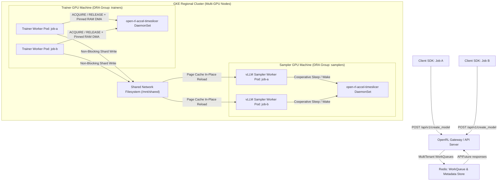
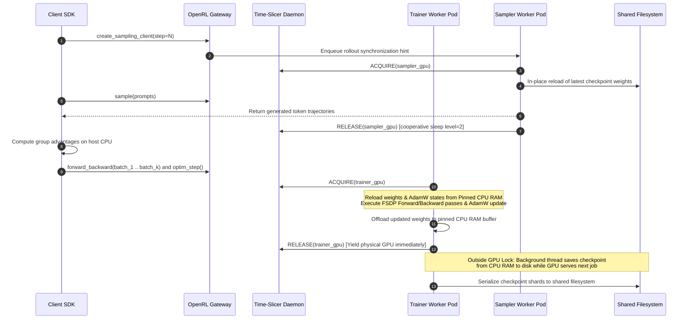

We completed an early implementation of full parameter fine-tuning support in OpenRL. The implementation lives in feature branch `upstream/fft` in the OpenRL repository at the moment and will be merged eventually to the main branch.

This document describes the design, architecture, system components, execution workflows, context-switching mechanics, empirical benchmark results, and upcoming next steps for Full Parameter Fine-Tuning (FFT) in OpenRL.

---

# Background

OpenRL is multi-tenant in the sense that it supports simultaneous fine-tuning of LLMs. Different users within an organization can fine-tune models for different needs—such as a financial reasoning agent and a legal document analysis agent—at the same time on shared compute hardware.

The API primitives exposed by OpenRL allow breaking a post-training or Reinforcement Learning (RL) job into discrete, schedulable work units. This decomposition enables individual execution phases—such as rollout trajectory sampling, reward scoring, gradient computation, optimizer parameter updates, and checkpoint serialization—to be scheduled and executed asynchronously across regional accelerator fleets.

---

# Problem

OpenRL natively supports multi-tenant fine-tuning for Low-Rank Adaptation (LoRA). That is possible because in LoRA, the base model weights remain frozen in GPU VRAM, and fine-tuning updates only lightweight rank-decomposed adapter layers representing approximately 0.1 percent to 1.0 percent of the total parameter count. Existing serving engines and training runtimes based on vLLM, SGLang, or PyTorch natively support LoRA, allowing multiple adapters to be served or trained selectively on top of a single shared base model.

For Full Parameter Fine-Tuning (FFT), 100 percent of the model parameters can be updated at every optimizer step (\(W_{t+1} = W_t - \eta \nabla L_t\)). This introduces two main challenges for simultaneous multi-tenant training and serving:

1. **In-Place Mutation Limitations Across Serving Engines:** High-throughput inference engines cannot natively mutate or reload multi-billion parameter weight matrices in place while concurrently serving requests for other tenants without disrupting active execution pipelines.
2. **Hardware Underutilization on Statically Partitioned Clusters:** Allocating separate, dedicated GPU clusters for training and sampling per tenant results in over 50 percent hardware idle time. While samplers generate rollout trajectories, training GPUs sit idle; while trainers compute gradient steps, inference GPUs sit idle.

---

# High level approach

OpenRL exposes training APIs that allow an RL step to be broken into discrete work units and also help break the work at natural phase boundaries of an RL step:
* **`create_sampling_client`**: Establishes a versioned sampling session bound to a specific checkpoint sequence number, signaling the transition from training to rollout generation and initiating weight synchronization.
* **`sample_rollouts`**: Batches prompt completion requests and dispatches rollout generation tasks to inference workers executing on dedicated sampler nodes.
* **`forward_backward`**: Batches training microbatches across worker processes to accumulate gradients without holding continuous GPU locks between minibatches.
* **`optim_step`**: Applies AdamW optimizer parameter updates to model weights and triggers asynchronous checkpoint serialization.

The key insight is: **if we break RL steps into work units that can be scheduled on a fleet of accelerators combined with fast context switching and memory offloading between work units, we can build a multi-tenant Full Parameter Fine-Tuning RL system.**

---

# Architecture

OpenRL decouples pod provisioning, task queuing, and physical GPU arbitration across control-plane and data-plane components:



### Control-Plane and Data-Plane Components

1. **OpenRL Gateway (`open-rl-gateway`)**:
   * Central REST API server receiving client SDK requests (`create_model`, `create_sampling_client`, `forward_backward`, `optim_step`).
   * Validates session payloads and routes execution work units into tenant-isolated queues.
2. **Kubernetes Worker Manager (`KubernetesFFTWorkerManager`)**:
   * Dynamically provisions dedicated worker pods (`open-rl-trainer-<job_id>` and `open-rl-sampler-<job_id>`) per tenant session when configured via `OPEN_RL_WORKER_MANAGER=kubernetes`.
   * Uses Kubernetes Dynamic Resource Allocation (DRA) (`ResourceClaim`) to bind trainer pods to node pools labeled `timeslice.io/group: trainers` and sampler pods to node pools labeled `timeslice.io/group: samplers`.
   * Sets container memory limits (`requests.memory: 18Gi`, `limits.memory: 80Gi`) to allow host CPU buffer offloading without kernel out-of-memory terminations.
3. **MultiTenant WorkQueue (`RequestStore`)**:
   * Backed by Redis, each tenant model receives an isolated FIFO data queue (`queue:<model_id>` and `sampler_queue:<model_id>`), preventing head-of-line blocking across tenants.
   * Workers pop execution tasks asynchronously and return completion payloads to `APIFuture` channels.
4. **Metadata Store**:
   * Centralized registry maintaining session state, worker readiness heartbeats (`open_rl:sampler_ready:<model_id>`), and checkpoint sequence numbers.
5. **Accelerator Time-Slicer DaemonSet (`open-rl-accel-timeslicer`)**:
   * Node-local daemon (`hostNetwork: true`, TCP port 9753) arbitrating physical GPU ownership across co-located pods using process snapshotting (`llm-snapshot` / `cuda-checkpoint`).
   * Supports two scheduling policies:
     * **`fifo` (First-In, First-Out):** Serves waiting workloads in arrival order (`deque.popleft()`).
     * **`lrs` (Least Recently Served, Recommended Default):** Tracks the wall-clock release timestamp (`last_release_time[job_id]`) of each workload and prioritizes whichever waiting job released the GPU least recently. LRS acts as a phase-balancing mechanism that separates concurrent workloads in time, preventing platooning and maintaining hardware overlap across nodes.
6. **FFT PyTorch Trainer Worker (`fft_trainer_worker.py`)**:
   * Executes PyTorch FSDP forward/backward passes and AdamW updates.
   * Uses explicit application-level CPU offloading (`sleep()`) to page-locked memory (`pin_memory=True`) before yielding GPU time slices, and reloads state (`wake_up()`) upon acquiring GPU locks.
7. **vLLM Dynamic Sampler Worker (`vLLM Worker`)**:
   * Executes rollout sampling wrapped around vLLM Dynamo.
   * Uses cooperative engine sleep (`sleep(level=2)`), purging KV cache pages and backing up weights before yielding the GPU. This reduces residual VRAM below 0.6 GiB and cuts physical snapshot latency by 50 percent.
8. **Shared Filesystem (`open-rl-shared-pvc` / NFS)**:
   * Managed network filesystem mounted at `/mnt/shared`.
   * Operates under a single-writer (Trainer pod), multi-reader (Sampler pods) pattern for versioned checkpoint distribution (`sampler-1`, `sampler-2`, `final`).

---

# UX

The following pseudocode shows an RL training loop using OpenRL SDK primitives:

```python
import tinker
from tinker_cookbook import rl

# Create a fine-tuning session from the service client
service_client = tinker.ServiceClient(base_url="http://open-rl-gateway-service:8000")
training_client = service_client.create_model(
    base_model="Qwen/Qwen3-8B",
    scenario="fft-gsm8k-rl",
    uv_extra="gpu"
)

# Loop begins
for step in range(max_steps):
    # Create sampling client from current model weights
    sampling_client = training_client.create_sampling_client(step=step)

    # Generate samples to produce a training batch
    rollout_batch = rl.sample_rollouts(
        sampling_client=sampling_client,
        prompts=dataset_prompts,
        num_rollouts_per_prompt=8
    )

    # Score completions and compute group-relative advantages on host CPU
    scored_batch = rl.compute_group_rewards(rollout_batch)

    # Do forward_backward on training batch across minibatches
    for mini_batch in scored_batch.iter_minibatches():
        training_client.forward_backward(mini_batch)

    # Do optim_step to update the parameters of the model
    training_client.optim_step()

# Evaluate accuracy
eval_metrics = rl.evaluate(training_client, holdout_prompts)
training_client.delete_model()
```

---

# Control Flow (Anatomy of an RL step in OpenRL)

A complete RL step coordinates control-plane signals and data-plane GPU handoffs across four phases:



1. **Rollout Initialization (`create_sampling_client`)**:
   * Creation of a sampling client acts as a signal for the beginning of the rollout phase and ensures model weights are transferred to the sampling subsystem.
2. **Batched Rollout Generation (`sample_rollouts`)**:
   * Sampling requests are batched together. At the beginning of sampling, sampling work is scheduled and a request to acquire the sampler GPU is made.
   * The sampler reloads updated model shards from NFS page cache in place and generates rollout trajectories. At the end of the sampling phase, the sampler GPU is yielded (`sleep level=2`).
3. **Training Step (`forward_backward` and `optim_step`)**:
   * The training step begins with forward-backward requests batched until `optim_step`.
   * The trainer acquires the trainer GPU lock, reloads weights and AdamW states from pinned CPU RAM into physical VRAM (`wake_up`), executes forward/backward passes and parameter updates, and offloads state back to pinned CPU RAM (`sleep`) before yielding the GPU lock.
4. **Decoupled Non-Blocking Checkpoint Export (`save_weights_for_sampler`)**:
   * Immediately after offloading state to pinned CPU RAM, the trainer releases the physical GPU lock early.
   * Serializing checkpoint shards to NFS runs on a background worker thread reading directly from pinned CPU RAM (`_param_shadow`), removing filesystem I/O from the GPU critical path.

---

# Context Switching and Weight Syncs

OpenRL leverages `llm-snapshot` (built over `cuda-checkpoint`) for switching processes on physical GPUs. Context switching latency depends on the amount of state moved between VRAM and DRAM.

---

# Sampler Context Switching

We use vLLM for sampling. We reset vLLM's VRAM memory before yielding the GPU. vLLM provides an abstraction called sleep/wake with granularity to reset model weights and KV cache. We use `sleep(level=2)` to reset model weights and KV cache between two sampling phases because model weights are updated at each step and KV cache is not reused across differing sampling inputs.

At the beginning of the sampling phase, vLLM loads the model weights from the shared filesystem. Since the filesystem is shared between trainer and sampler, reloading weights happens quickly because recently written checkpoint blocks reside in the Linux kernel filesystem page cache.

The table below shows sampler context switching times across Qwen 0.5B (600 million parameter class), 4B, and 8B models:

| Model Class | Target Architecture | Physical Snapshot (Freeze VRAM to RAM) | Physical Restore (Reload RAM to VRAM) | Total Sampler Context Switch Latency |
| :--- | :--- | :---: | :---: | :---: |
| **Small (600 Million Parameter class)** | `Qwen/Qwen2.5-0.5B` | 1.00s ± 0.01s | 0.50s ± 0.01s | **1.50 seconds** |
| **Medium (4 Billion Parameter class)** | `Qwen/Qwen2.5-4B` | 2.00s ± 0.01s | 1.00s ± 0.01s | **3.00 seconds** |
| **Large (8 Billion Parameter class)** | `Qwen/Qwen3-8B` | 3.00s ± 0.01s | 1.00s ± 0.01s | **4.00 seconds** |

---

# Trainer Context Switching

We use a PyTorch FSDP-based trainer. To assist with fast context switching between training steps, we offload model training state (weights, AdamW optimizer state, momentum buffers) from VRAM to DRAM in a pinned CPU buffer (`pin_memory=True`) before yielding the GPU, and reload from pinned DRAM upon acquiring the GPU. Pinned buffers transfer state across PCIe Gen5 lanes at approximately 15.8 GB/s during offload and 17.7 GB/s during reload.

Because we offload model state from VRAM to DRAM at the end of the training step, we release the GPU as soon as training and offloading finish. Training for another tenant job can begin immediately without holding the GPU during weight transfer. We save model weights from CPU memory when a client initiates a `create_sampling_client` request. Decoupling model weight saving to CPU memory allows using tiered storage for saving and transferring weights.

The table below shows trainer context switching and CPU buffer offload/reload times across Qwen 0.5B, 4B, and 8B models:

| Model Class | Total Training State (Weights + AdamW FP32) | App Offload to Pinned CPU RAM (`sleep`) | App Reload to CUDA VRAM (`wake_up`) | Physical Snapshot (`llm-snapshot`) | Physical Restore (`llm-snapshot`) | Total Trainer Switch Latency |
| :--- | :--- | :---: | :---: | :---: | :---: | :---: |
| **Small (600 Million Parameter class)** | ~2.8 GiB | 0.35s | 0.28s | 1.50s | 1.00s | **~3.13 seconds** |
| **Medium (4 Billion Parameter class)** | ~22.5 GiB | 1.12s | 0.98s | 4.01s | 2.00s | **~8.11 seconds** |
| **Large (8 Billion Parameter class)** | ~32.0 GiB | 2.02s ± 0.03s | 1.80s ± 0.002s | 4.01s ± 0.01s | 3.00s ± 0.01s | **10.83 seconds** |

---

# Weight Sync

Offloading model weights to CPU memory decouples weight syncing from trainer GPU ownership. Checkpoint serialization runs asynchronously on a background thread reading directly from CPU memory (`_param_shadow`). This enables delta synchronization because a snapshot of previous model weights is maintained in CPU memory, and it supports streaming weights to samplers from tiered storage.

The table below compares model saving times to the filesystem for Qwen 0.5B, 4B, and 8B models under legacy blocking GPU export versus non-blocking background export:

| Model Class | Checkpoint File Size (`safetensors`) | Legacy Blocking GPU Export Time | Non-Blocking Export Time (OpenRL) | Active GPU Idle Time During Save |
| :--- | :--- | :---: | :---: | :---: |
| **Small (600 Million Parameter class)** | ~1.0 GB | 4.2s to 6.5s | 4.2s to 6.5s | **0.0 seconds** (Runs in background) |
| **Medium (4 Billion Parameter class)** | ~8.0 GB | 74.1s to 87.5s | 74.1s to 87.5s | **0.0 seconds** (Runs in background) |
| **Large (8 Billion Parameter class)** | ~16.0 GB | 155.0s to 179.0s | 61.8s to 67.2s | **0.0 seconds** (Runs in background) |

---

# Test Runs

We verified the Full Parameter Fine-Tuning implementation by running two simultaneous Reinforcement Learning jobs (`job-a` and `job-b`) training `Qwen/Qwen3-8B` on the GSM8K dataset (`fft-gsm8k-rl-x2`) sharing dual NVIDIA H100 80GB nodes on GKE.

### 1. Mathematical Accuracy, Formatting, and Rollout Length Progression

| Metric / Training Stage | Step 0 (Start) | Step 10 (33% Mark) | Step 19 (66% Mark) | Step 24 (80% Mark) | Step 30 (Completion) |
| :--- | :---: | :---: | :---: | :---: | :---: |
| **`job-b` Accuracy (`Correct`)** | 9.90% | 94.27% | 96.35% | 98.96% | **100.00%** |
| **`job-a` Accuracy (`Correct`)** | 8.85% | 95.31% | 97.40% | 97.92% | **100.00%** |
| **`job-b` Formatting (`Format`)** | 6.77% | 93.75% | 95.83% | 98.96% | **100.00%** |
| **`job-a` Formatting (`Format`)** | 6.77% | 94.27% | 95.83% | 99.48% | **100.00%** |
| **Avg Token Rollout Length** | ~507 tokens | ~347 tokens | ~267 tokens | ~226 tokens | **~220 tokens (-55%)** |

* Both concurrent models reached 100.00 percent holdout evaluation accuracy by Step 30, with 100.00 percent adherence to the required `\boxed{}` output format.
* Policy optimization reduced average rollout length by 55 percent (from 507 tokens down to 220 tokens per turn).

### 2. Step Execution Timing Breakdown

| Execution Phase | Duration (Interleaved on 1 GPU) | Solo Duration (Final Step) | Workload Description |
| :--- | :---: | :---: | :--- |
| **vLLM Rollout Sampling** | 185.8s to 195.4s | 164.4s to 168.0s | 24 prompt groups × 8 rollouts (up to 512 tokens) |
| **PyTorch Policy Update** | 146.6s to 159.2s | 111.4s | FSDP forward/backward passes + AdamW step |
| **Time-Slicer State Sync** | 61.8s to 67.2s | 62.1s | Async memory offload & non-blocking export |
| **Total Step Time (`time/total`)** | **330.5s to 356.1s** | **279.8s** | Average step duration: ~3.7 minutes |

### 3. FIFO vs. Least Recently Served (LRS) Scheduling Comparison

Across multi-tenant runs, Least Recently Served (LRS) scheduling prevented lockstep platooning compared to FIFO queueing:
* **Average Step Duration:** Reduced by 9.4 percent (from 143.70s under FIFO to 130.26s under LRS).
* **Minimum Step Duration:** Reduced by 27.5 percent (from 70.19s under FIFO to 50.89s under LRS) when out-of-phase compute overlapped across nodes.

### 4. GPU Utilization Metrics

Analysis of 172 minutes of Cloud Monitoring metrics across both H100 nodes confirmed hardware utilization:

| GPU Node Role | Active Logged Minutes | Max 1-Minute Mean Util | Overall Mean Util | Primary Workload |
| :--- | :---: | :---: | :---: | :--- |
| **Trainer GPU (`tpdj`)** | 172 min (100%) | **76.8%** | 14.3% | PyTorch AdamW & RL policy gradient updates |
| **Sampler GPU (`r8f5`)** | 157 min (100% post-restart) | **100.0%** | 8.5% | vLLM rollout generation (up to 512 tokens) |

---

# Miscellaneous

### Platooning Under FIFO Queueing and LRS Scheduling Strategy

During multi-tenant cluster testing where workloads share regional GPU nodes via time-slicing, we discovered that standard First-In, First-Out (FIFO) queueing causes workload platooning. When concurrent jobs start simultaneously or synchronize, workloads bunch up into sequential lockstep queues (`1 -> 2 -> 3 -> 1 -> 2 -> 3`). As a result, one GPU node sits idle while waiting jobs queue on the opposite node, inflating iteration durations by over 50 percent.

We solved this problem by introducing an alternative scheduling strategy: **Least Recently Served (LRS)** (`--scheduling-policy lrs`). Whenever a workload releases a GPU lock, the time-slicer records its departure timestamp (`last_release_time[job_id]`). When multiple workloads compete for a free GPU lock, the scheduler prioritizes whichever waiting job released the GPU least recently. LRS acts as an automatic phase-balancing mechanism that forces concurrent workloads out of phase, breaking lockstep queues and maintaining continuous cross-node hardware utilization.

---

# Conclusions and Next Steps

The early Full Parameter Fine-Tuning implementation demonstrates that decomposing RL steps into discrete work units—combined with pinned host memory offloading and Least Recently Served (LRS) time-slicing—enables multi-tenant full fine-tuning on shared GPUs without static partitioning or platooning.

Upcoming milestones include:

1. **Peer-to-Peer GPU Memory Streaming:** Replacing NFS filesystem checkpoint serialization with direct NCCL or CUDA IPC peer-to-peer weight streaming between co-located trainer and sampler pods.
2. **Delta Weight Synchronization:** Transmitting only parameter deltas (\(\Delta W_t = W_{t} - W_{t-1}\)) or float8 quantized differences from pinned CPU memory to sampling engines, reducing transfer volume by over 80 percent.
3. **Tiered Object Storage Offloading:** Saving checkpoints from host CPU memory directly to cloud object storage buckets without consuming regional filesystem IOPS.
4. **Relational Database Metadata Backend:** Migrating session metadata, DRA resource mappings, and checkpoint sequence tracking from Redis to PostgreSQL.
