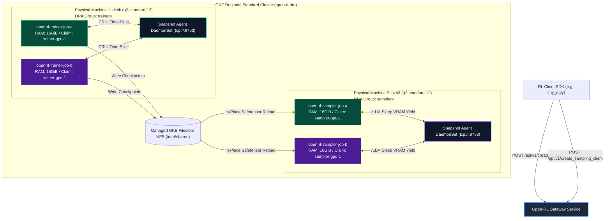

# Open-RL Kubernetes Pod Placement Architecture Walkthrough

This document provides an end-to-end architectural walkthrough of how Open-RL schedules, places, and virtualizes multi-tenant Supervised Fine-Tuning (SFT) and Reinforcement Learning (RL) workloads across a distributed Kubernetes infrastructure.

---

## High-Level Topology

Open-RL decouples policy gradient computation (Trainers) from rollout generation (Samplers). In a multi-tenant environment (such as concurrent `job-a` and `job-b` experiments), Gateway orchestrates worker pods across dedicated physical GPU machines while ensuring strict boundary isolation.



---

## 1. Decoupled Dynamic Pod Rendering

When a client initiates a training loop, Gateway intercepts the session requests inside `k8s_worker_manager.py`. Rather than using static Kubernetes Deployments, Gateway dynamically deepcopies role-specific Pod YAML templates mounted from ConfigMaps:

- **Trainer Pod Template**: Loaded from ConfigMap `open-rl-config` defined in `05-worker-pod-template.yaml`.
- **Sampler Pod Template**: Loaded from ConfigMap `open-rl-sampler-worker-pod-template` defined in `09-sampler-pod-template.yaml`.

Gateway injects unique runtime identifiers (`model_id`, `job_id`, and `OPEN_RL_WORKER_IMAGE` overrides) before submitting imperative `create_namespaced_pod` API calls.

---

## 2. Dynamic Resource Allocation (DRA) Claim Sharing

Standard Kubernetes device plugins (`resources.limits: nvidia.com/gpu: 1`) enforce exclusive physical GPU locks: once Pod A lands on a node, `kube-scheduler` rejects Pod B until Pod A terminates.

Open-RL bypasses this limitation using **Kubernetes Dynamic Resource Allocation (DRA)** exact allocation claims:

```yaml
# Inside 05-worker-pod-template.yaml (Trainer Spec)
spec:
  resourceClaims:
  - name: trainer-gpu
    resourceClaimName: open-rl-trainer-gpu-1
```

```yaml
# Inside 09-sampler-pod-template.yaml (Sampler Spec)
spec:
  resourceClaims:
  - name: sampler-gpu
    resourceClaimName: open-rl-sampler-gpu-1
```

### How Claim Co-Scheduling Works:
1. **First Tenant (`job-a`)**: When `open-rl-trainer-job-a` spawns, it binds singleton claim `open-rl-trainer-gpu-1` to Physical Machine 1 (`dcbk`).
2. **Second Tenant (`job-b`)**: When `open-rl-trainer-job-b` spawns seconds later, `kube-scheduler` inspects its `resourceClaimName`. Because `open-rl-trainer-gpu-1` is already allocated on `dcbk`, **Kubernetes co-schedules Job B directly onto `dcbk` alongside Job A**!

---

## 3. Strict Role Segregation via `nodeSelector`

> [!WARNING]
> Co-locating PyTorch AdamW optimizers and vLLM KV caches on the same physical GPU causes immediate CUDA out-of-memory crashes (`CUDA error: out of memory`).

To prevent cross-role contamination, nodes in the `gpu-dra` node pool are tagged with explicit role labels:
- Machine 1 (`dcbk`): `group.timeslice.io/trainers="true"`
- Machine 2 (`hzp3`): `group.timeslice.io/samplers="true"`

Pod specs enforce strict landing boundaries:
- **Trainers**: Enforce `nodeSelector: { group.timeslice.io/trainers: "true" }` and set `OPEN_RL_TIME_SLICE_GROUP=trainers`.
- **Samplers**: Enforce `nodeSelector: { group.timeslice.io/samplers: "true" }` and set `OPEN_RL_TIMESLICE_GROUP=samplers`.

---

## 4. Host RAM Oversubscription Tuning

A standard GKE `g2-standard-12` virtual machine provides **48 GiB** of system CPU RAM. 

When scheduling multiple tenant pods onto a single machine, `kube-scheduler` calculates memory feasibility based on `resources.requests.memory`.

| Component / Tenant Pod | Requested CPU Memory | Cumulative Allocated RAM | Node Feasibility on `g2-standard-12` (48 GiB Total) |
| :--- | :---: | :---: | :---: |
| **System Overhead** *(DaemonSets, CSI, Calico)* | ~4 GiB | 4 GiB | Schedulable (44 GiB Remaining) |
| **Tenant 1 Trainer** (`job-a`) | 16 GiB | 20 GiB | Schedulable (28 GiB Remaining) |
| **Tenant 2 Trainer** (`job-b`) | 16 GiB | 36 GiB | **Schedulable (12 GiB Remaining)** $\checkmark$ |

> [!TIP]
> Prior to tuning, templates requested `24Gi` and `32Gi` of CPU memory. Under those defaults, Tenant 1 allocated $24 + 4 = 28\text{ GiB}$, leaving only $20\text{ GiB}$ remaining. When Tenant 2 requested `24Gi`, Kubernetes rejected the pod with `FailedScheduling: Insufficient memory`. Lowering requests to `16Gi` unlocked true multi-tenant concurrency.

---

## 5. Node-Local Time-Slicing Virtualization

Once co-scheduled onto the same physical GPU, workloads are virtualized in-flight by the node-local DaemonSet defined in `07-snapshot-agent-daemonset.yaml`.

### A. Trainer Virtualization (CRIU Process Swapping)
On the Trainer Node (`dcbk`), the Snapshot Agent intercepts PyTorch CUDA allocations over `tcp://status.hostIP:9753`. When Job A finishes its microbatch gradient calculation:
1. Snapshot Agent freezes Job A's Linux process via CRIU (`checkpointed pid 34715 in 1.99s`).
2. Snapshot Agent restores Job B's memory state into VRAM (`restored pid 34716 in 0.39s`).

### B. Sampler Virtualization (vLLM Cooperative Sleep)
On the Sampler Node (`hzp3`), vLLM inference engines time-slice cooperatively inside `vllm_sampler.py`:
1. **Sleep Preemption**: Upon completing a sampling batch, vLLM invokes `await engine.sleep(level=2)`, instantly discarding physical GPU memory pages (`freed 19.45 GiB`).
2. **NFS Weight Synchronization**: When Trainer A writes new SFT weights to `/mnt/shared`, Sampler A detects the modification, wakes up physical VRAM (`0.04s`), and reloads the checkpoint safetensors in-place directly from NFS page cache (`took 1.19 seconds`)!
