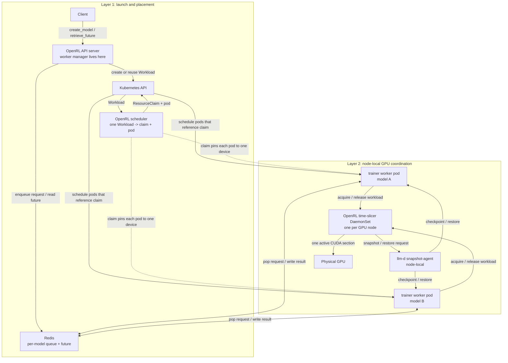
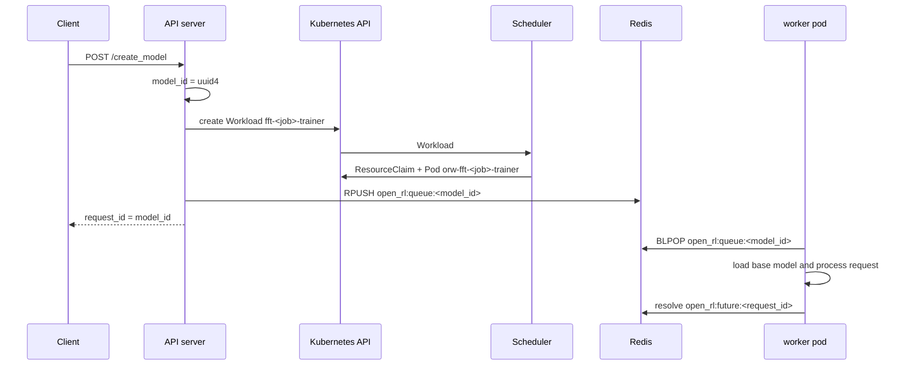

# FFT time slicing

How full fine-tuning (FFT) workers share GPUs. To deploy it, use the
`openrl-fft.yaml` bundle from [Deploy OpenRL on Kubernetes](../setup/kubernetes.md).
The design separates three ideas that build on each other:

1. **Workload placement:** the API server creates one `Workload` per worker
   process, and the OpenRL scheduler turns each into a DRA `ResourceClaim` and
   a pod, sharing a claim between workers when the cluster is full.
2. **DRA pinning:** every pod that references a claim is scheduled onto the
   node that holds that claim's device.
3. **OpenRL GPU coordination:** a node-local accelerator time-slicer DaemonSet serializes
   acquire/release so only one workload in a role group enters a CUDA batch at
   a time on that node, and layers on top of llm-d's physical snapshot agent for
   kernel-level checkpoint/restore.

## Architecture at a glance

There are three separate responsibilities.

First, the API server is the launcher, and it launches by asking. When it receives
`create_model` in FFT mode it creates a `Workload` for that job's trainer; when
it receives `create_sampling_client` it creates one for the sampler. Each
Workload carries the complete pod template and the estimator's accelerator
figure. It enqueues the request on the model-specific Redis queue. It is
idempotent: a Workload that already exists is reused.

Second, the OpenRL scheduler (`scheduler/`) places. For each Workload it cuts
or selects a DRA `ResourceClaim`, renders the pod from the Workload's template
with the claim and node affinity stamped on, and Kubernetes allocates one
matching NVIDIA GPU to the claim and schedules the pod onto that node. DRA is
used only for allocation and placement.

Third, the OpenRL accelerator time-slicer is the runtime GPU coordinator. It runs as a
node-local DaemonSet (`open-rl-accel-timeslicer`) on GPU nodes with `hostNetwork` enabled. Trainer and
sampler worker pods connect to the agent on their node with
`OPEN_RL_ACCEL_TIMESLICER_HOST=status.hostIP` and
`OPEN_RL_ACCEL_TIMESLICER_PORT=9753`. The training processor registers its
workload identity with the agent and wraps GPU work in acquire/release calls.
The agent keeps a FIFO queue per node-local process, allows one active workload
at a time within that process, checkpoints on release, and restores on acquire.
In the cluster deployment, the OpenRL time-slicer runs with `--backend llmd`;
llm-d's physical snapshot agent performs the actual pod/PID discovery and CUDA
checkpoint/restore.

The request flow is:

1. A client calls `create_model`.
2. The API server creates a unique `model_id`.
3. The API server ensures a trainer `Workload` exists for that job.
4. The scheduler cuts or selects a `ResourceClaim` and creates the worker pod
   against it, so Kubernetes places it on the node holding that device.
5. The API server enqueues the create request on the model's Redis queue.
6. The trainer worker drains that queue and uses the node-local time slicer
   before entering CUDA sections.

The whole shape has two layers. The top layer creates Workloads, places them,
and moves requests through Redis. The bottom layer runs on the GPU node and
coordinates which colocated trainer worker may enter CUDA.



The orchestration is currently cooperative: worker code calls acquire/release,
and the OpenRL time slicer serializes those calls with a FIFO lock. The
scheduler only places pods; it is not the runtime time-slice scheduler.

## 1. The API server creates one Workload per worker process

The per-model Redis queues and future protocol are unchanged. What differs is
how workers are launched: with `OPEN_RL_WORKER_MANAGER=scheduler`, the
API server's `server/scheduler_worker_manager.py` creates one `Workload` object
per runtime process and stops. FFT jobs own their processes
(`fft-<job>-trainer`, `fft-<job>-sampler`); LoRA jobs on one base model share
them (`lora-<base>-0-<role>`), so a second compatible request hits
`AlreadyExists` and reuses the running worker.



The Workload carries the complete pod template -- image, entrypoint, identity
env, resources, volumes -- plus the estimator's accelerator figure
(`spec.accelerator.memory`) and the fairness unit (`spec.ownerID`). Everything
placement-shaped is deliberately absent: the scheduler cuts or selects the DRA
`ResourceClaim`, stamps the claim reference, node affinity, and time-slice
group onto the pod, and rejects a template that tries to set them itself.
See `scheduler/docs/design.md` for the placement rules.

## 2. DRA pins the GPU allocation

Each `ResourceClaim` the scheduler cuts lists the device shapes that can hold
the worker, and Kubernetes allocates one matching device and schedules the
pod onto that node. Several Workloads may be seated on one claim; the scheduler
keeps that seating on a `ClaimLedger`, and exactly one seated worker is
resident on the device at a time.

DRA is the allocation and placement layer. It does not serialize CUDA execution
by itself. This is intentionally an oversubscription model: multiple worker
pods can share one GPU claim, and OpenRL decides which one may touch CUDA at a
given time.

## 3. A node-local time slicer coordinates GPU windows

The FFT bundle includes `k8s/deploy/fft-runtime/07-accel-timeslicer-daemonset.yaml`, which runs one
OpenRL accelerator time-slicer on each trainer or sampler GPU node:

```yaml
hostNetwork: true
command: ["uv", "run", "python", "-m", "accel_timeslicer.serve"]
args:
  ["--listen-host", "0.0.0.0", "--port", "9753",
   "--backend", "llmd", "--llmd-snapshot-endpoint", "127.0.0.1:9001"]
```

The dynamically launched trainer worker pods run the normal training processor:

```yaml
command: ["uv", "run", "python", "-m", "server.training_requests_processor"]
```

The training processor uses:

- `OPEN_RL_ACCEL_TIMESLICER_HOST` from the pod's `status.hostIP`
- `OPEN_RL_ACCEL_TIMESLICER_PORT=9753`
- `OPEN_RL_TIME_SLICE_JOB_ID`, aligned with the `timeslice.io/job-id` label
- `OPEN_RL_TIME_SLICE_GROUP`, aligned with the `timeslice.io/group` label

Trainer workers talk to the OpenRL coordinator on their node. OpenRL owns the
in-memory queue and active/checkpointed state for workloads sharing the physical
GPU. The worker pod labels provide the workload identity llm-d uses to discover
the relevant pod and process set.

## Worker pods

There are no static worker deployments. Every `create_model` call makes the API server create a trainer `Workload` (`fft-<job>-trainer`), and every `create_sampling_client` call makes it create a sampler one (`fft-<job>-sampler`); the scheduler creates the pod for each as `orw-<workload name>`. Both pods are labeled:

```yaml
accel-timeslicer: "true"            # OpenRL time-slicer marker
timeslice.io/group: <claim name>    # the ResourceClaim the pod shares
timeslice.io/job-id: <workload name>
```

The API server's `open-rl-sa` service account has a Role allowing Workload CRUD in the workload namespace (`k8s/deploy/base/rbac.yaml`); the scheduler runs as the same account with the roles its own manifests add. After each training step the trainer writes a sparse weight delta to the shared volume (`/mnt/shared`), and the sampler applies it through vLLM's weight transfer engine before its next batch.

### Structured Model Serialization in Redis
To ensure reliable metadata persistence across API server restarts and worker spawns, model configuration is serialized in Redis using the `TrainingModelMetadata` dataclass:
- **Generic KV Store:** The `RequestStore` interface provides generic `set_value`, `get_value`, and `delete_values` operations for storing structured objects alongside tenant request queues.
- **Mandatory Architecture Specification:** The `/api/v1/create_model` endpoint strictly requires a valid `base_model` in the request payload, guaranteeing deterministic worker pod configuration.

### Zero-Fragmentation Application-Level CPU Offloading
When multiple training jobs share physical GPUs via the Accelerator Time-Slicer, `FFTTrainingWorker` performs zero-fragmentation memory swapping between VRAM and Pinned DRAM during time-slicer `acquire()` and `release()` cycles:
- **Client Toggle:** Configured via `cpu_offload: bool = True` inside `FFTConfig`.
- **Symmetric Primitives:** `sleep()` transfers model parameters and initialized AdamW optimizer states (`exp_avg`, `exp_avg_sq`) to pinned host memory (`.to("cpu", non_blocking=True).pin_memory()`) while replacing GPU tensors with empty shells (`torch.empty(0, ...)`). `wake_up()` reloads pinned shadow tensors back to CUDA instantly before processing training requests.

### llm-d Snapshot Agent
Because `open-rl-accel-timeslicer` runs with `--backend llmd` in the cluster, it delegates the physical kernel-level CUDA freeze/thaw (`cuda-checkpoint`) to the llm-d Snapshot Agent over gRPC on `127.0.0.1:9001`. The FFT bundle includes `k8s/deploy/fft-runtime/00-llmd-snapshot-agent.yaml`, which deploys that agent as a DaemonSet in `openrl-system` on every node labeled `nvidia.com/gpu.present=true`, running the `v0.1.0` release image upstream publishes to `ghcr.io/llm-d-incubation/llm-d-rl-time-slicing/snapshot-agent`. There is nothing to build or install by hand; the manifest's header comment covers moving to a newer agent build.
