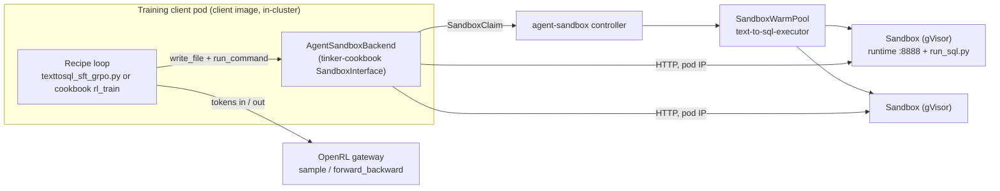

# Sandboxed reward execution

RL rewards that *run* model output are the common case: SQL against a database,
a program against tests, a tool call against a service. That output is
untrusted. This guide shows how the Text-to-SQL recipe executes model-written
SQL in gVisor sandboxes managed by
[kubernetes-sigs/agent-sandbox](https://github.com/kubernetes-sigs/agent-sandbox),
and how the same backend plugs into tinker-cookbook recipes unchanged.
Design: [013-sandboxed-rewards-text-to-sql](designs/013-sandboxed-rewards-text-to-sql.md).

## What runs where



The trust boundary is the model's output and nothing else:

| Runs in the sandbox | Stays in the client |
| --- | --- |
| the model's SQL, against the example's schema | dataset filtering (`build_dataset_rows` executes the *target* SQL thousands of times to precompute rows) |
| | the target query when its rows were not precomputed |
| | scoring (`score_from_execution`), which only compares rows |

The sandbox holds no credential: no service-account token is mounted, no
environment variable can be injected by a claim, the root filesystem is
read-only, and the template's network policy allows ingress only from the
training namespace on :8888 and declares no egress. Isolation is gVisor via
`runtimeClassName: gvisor`.

> **NetworkPolicy needs enforcement.** The controller creates the policy from
> the template, but it only takes effect on clusters with a policy-enforcing
> dataplane (GKE Dataplane V2 or the NetworkPolicy add-on). On a cluster
> without one the sandbox is still gVisor-isolated but can open outbound
> connections. Check with `gcloud container clusters describe <cluster> --format="value(networkConfig.datapathProvider,networkPolicy.enabled)"`.

## Components

| Piece | Where | What |
| --- | --- | --- |
| runtime image `open-rl-sql-executor` | `examples/text-to-sql/sandbox/` | agent-sandbox's reference runtime server plus `/opt/run_sql.py`, which runs schema then query in an in-memory SQLite with the recipe's 250 ms deadline and float rounding, and prints `{"rows": ..., "error": ...}` |
| Kubernetes resources | `examples/text-to-sql/k8s/agent-sandbox/` | `SandboxTemplate text-to-sql-executor`, a `SandboxWarmPool`, and a Role letting `open-rl-sa` claim sandboxes |
| backend | `examples/common/agent_sandbox.py` | `AgentSandboxBackend` (implements `SandboxInterface`), `AgentSandboxPool` (N long-lived sandboxes, leased), `make_sandbox_factory` (one claim per call), `run_sql_in_sandbox` |
| Phase A consumer | `examples/text-to-sql/texttosql_sft_grpo.py` | `reward.executor=agent_sandbox` scores every rollout and eval through a pool lease |
| Phase B consumer | `examples/text-to-sql/cookbook/` | a cookbook `rl_train` recipe whose `EnvGroupBuilder` claims one sandbox per prompt group |
| Job manifests | `examples/text-to-sql/k8s/job-*.yaml` | run either consumer in-cluster from the client image |

## Setup

1. Install agent-sandbox with its extensions (SandboxTemplate, SandboxWarmPool, SandboxClaim):

   ```bash
   kubectl apply --server-side -f https://github.com/kubernetes-sigs/agent-sandbox/releases/download/v1.0.1/sandbox-with-extensions.yaml
   kubectl -n agent-sandbox-system rollout status deploy/agent-sandbox-controller
   ```

2. Make sure gVisor pods can schedule. On GKE that means a node pool with GKE Sandbox:

   ```bash
   gcloud container node-pools create sandbox-pool --cluster <cluster> --region <region> \
     --machine-type e2-standard-4 --sandbox type=gvisor --num-nodes 1 \
     --enable-autoscaling --min-nodes 0 --max-nodes 3
   ```

   The `gvisor` RuntimeClass carries the node selector and toleration; the template does not need them.

3. Build the executor image and apply the template, warm pool and RBAC:

   ```bash
   make cloud-build-sql-executor GCP_PROJECT=<project> CLOUD_IMAGE_TAG=<tag>
   kubectl kustomize examples/text-to-sql/k8s/agent-sandbox \
     | sed "s#ghcr.io/gke-labs/open-rl/sql-executor:latest#<registry>/open-rl-sql-executor:<tag>#" \
     | kubectl apply -f -
   kubectl -n openrl-system get sandboxwarmpools   # READY should equal REPLICAS
   ```

4. The client image installs the `sandbox` extra of the examples project
   (`k8s-agent-sandbox[async]`). For a laptop checkout:
   `uv --project examples sync --extra sandbox`.

## Phase A: the Gemma recipe with `reward.executor=agent_sandbox`

```bash
kubectl -n openrl-system apply -f examples/text-to-sql/k8s/job-recipe-sandboxed.yaml
```

or through the e2e runner:

```bash
make cluster-e2e E2E_SCENARIO=lora-textsql \
  E2E_ARGS="base_model=google/gemma-4-e2b steps=80 extra='rl.prompts_per_step=8 rl.samples_per_prompt=8 rl.eval_every=10 dataset.rl_train_limit=5000 dataset.eval_limit=100 reward.executor=agent_sandbox reward.pool_size=4'" \
  E2E_IMAGE=<client image>
```

The `reward` group: `executor` (`local` | `agent_sandbox`), `warm_pool`,
`namespace`, `pool_size` (long-lived sandboxes leased round-robin),
`ready_timeout`, `exec_timeout`. Each training step logs
`sandbox_exec_p50_ms` / `sandbox_exec_p95_ms` (the round trip),
`sandbox_wait_p95_ms` (time queued for a lease) and `sandbox_errors`
(transport failures, which score like a failed query but are counted
separately).

Measured on GKE (`open-rl-dra`, e2-standard-4 gVisor node, in-cluster client):

| | |
| --- | --- |
| warm-pool claim | 0.2–2.0 s |
| one SQL round trip (upload + execute) | p50 ≈ 110 ms, p95 ≈ 160 ms |
| runaway query (`WITH RECURSIVE` bomb) | interrupted at 250 ms, scored as an error |
| 64 rollouts per step against 4 sandboxes | ≈ 2 s of scoring per step; lease wait dominates, so raise `pool_size` (and the warm pool) before anything else |

Acceptance run (Gemma-4-e2b LoRA, `phase=rl_only`, 80 steps, 8 prompts × 8
samples, lr 5e-6, eval every 10 steps on 100 held-out examples; 50 minutes
wall clock, 5,488 rollouts, 0 sandbox errors) against the same recipe with
in-process execution, run the same day:

| Eval step | 0 | 10 | 20 | 30 | 40 | 50 | 60 | 70 | 80 |
| --- | --- | --- | --- | --- | --- | --- | --- | --- | --- |
| execution match, sandboxed | 6% | 8% | 10% | 13% | 14% | 14% | 18% | 24% | 25% |
| execution match, local | 6% | 9% | 10% | 13% | 16% | 15% | 19% | 19% | 26% |
| similarity, sandboxed | 37% | 37% | 38% | 44% | 48% | 52% | 58% | 62% | 65% |

Same curve within eval noise: moving execution into the sandbox changes where
the SQL runs, not what the model learns.

## Phase B: a cookbook `rl_train` recipe

```bash
kubectl -n openrl-system apply -f examples/text-to-sql/k8s/job-cookbook-rl.yaml
kubectl -n openrl-system get sandboxclaims -w     # one claim per prompt group per step
```

`examples/text-to-sql/cookbook/train.py` builds the cookbook's `Config`
exactly as `recipes/math_rl/train.py` does; the only OpenRL-specific parts
are `base_url` and `save_every=0`. `TextToSqlGroupBuilder.make_envs` claims a
sandbox through the injected factory (the `harbor_rl` pattern), the
`group_size` envs share it, and `cleanup` deletes the claim.
`rollout_error_tolerance=MinViableGroup()` means a failed claim costs one
rollout, not the group. `sandbox=local` runs the SQL in-process for smoke tests.

Qwen3-1.7B with the `qwen3_disable_thinking` renderer is the cookbook path
because the cookbook ships no Gemma renderer.

Measured (40 batches of 8 groups × 8 samples, lr 1e-5, eval every 10 batches
on 100 held-out examples): 21 minutes wall clock, about 31 s per batch of
which the sandboxed rollouts take 6 s on average (16 s on the first batches); 324 claims created and 324 terminated,
none left after the pod exited; claim latency 0.2 s when a pre-warmed pod is
free, median 2.6 s over the run, worst 10 s while the pool replenished. Held-out execution match 54% → 58% → 60% → 60%
at batches 0, 10, 20, 30; Qwen3-1.7B already solves most of this task, so
the headroom is small.

The first run claimed one sandbox per held-out *example* as well: 100 claims
at once against a 4-replica pool, most cold-starting a gVisor pod at ~80 s,
and the eval took longer than the training. Evals now lease from a shared
pool (`eval_pool_size`); training groups keep one claim each, which is the
behaviour the demo is about.

## Using the backend elsewhere

`AgentSandboxBackend` is a drop-in `SandboxInterface`. Anything in
tinker-cookbook that accepts a `sandbox_factory` (for example `harbor_rl`) can
take `make_sandbox_factory(warm_pool=..., namespace=...)` and run on a
Kubernetes warm pool instead of Modal or SandboxFusion. Upstreaming it as a
`SandboxBackend.AGENT_SANDBOX` value is the follow-up; the module has no
Text-to-SQL dependency apart from `run_sql_in_sandbox`.

Two runtime facts worth knowing when reusing it:

* the reference runtime `shlex`-splits commands and runs them without a shell
  from its base directory, so `run_command(..., workdir=...)` wraps the command
  in `sh -c`, and paths are relative to `SANDBOX_BASE_DIR` (`/app/work` here);
* the SDK's async client reaches sandboxes by pod IP, which is why the client
  Job runs in-cluster; for a laptop, the synchronous SDK client's local-tunnel
  mode (`kubectl port-forward`) is the alternative, not covered by this backend.

Unit tests: `make test examples` (a fake sandbox runs the real `run_sql.py`
and the results are compared with the local scorer).
