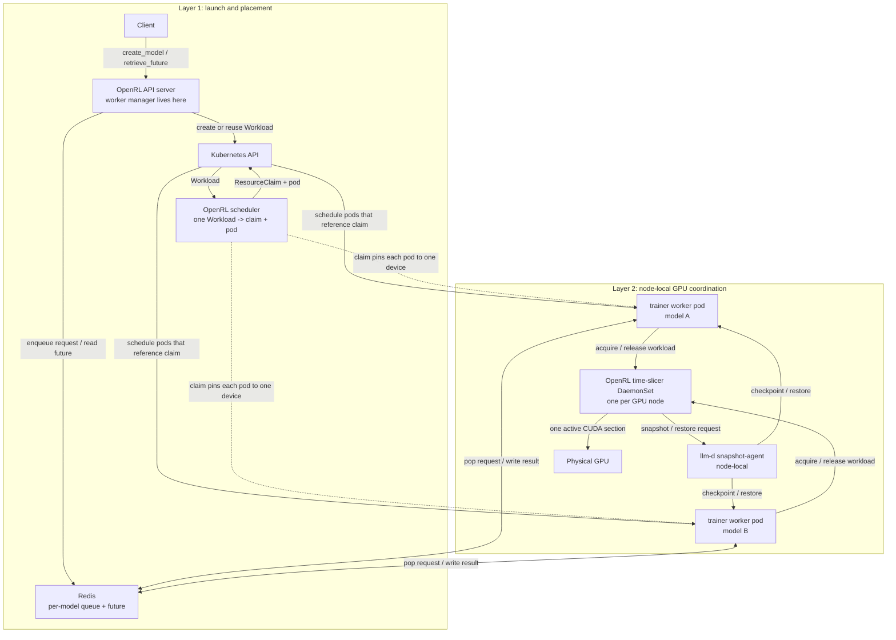
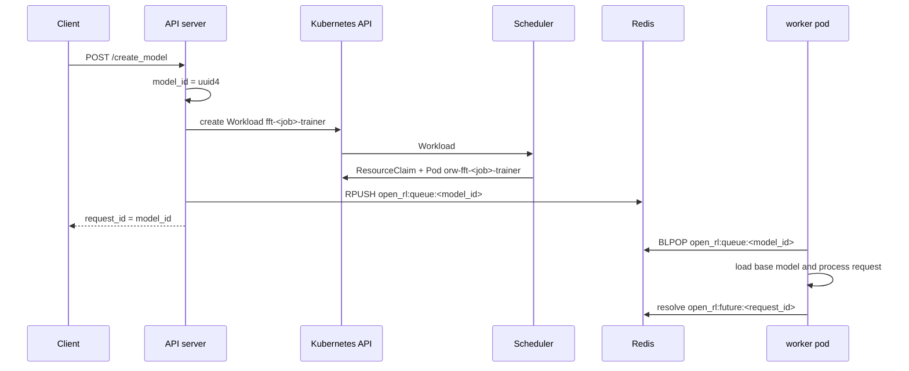

# GKE FFT Time-Slice Setup Guide

This guide describes the cluster shape for FFT on shared GPUs. It separates
three ideas that build on each other:

1. **Workload placement:** the API server creates one `Workload` per worker
   process, and the OpenRL scheduler turns each into a DRA `ResourceClaim` and
   a pod, sharing a claim between workers when the cluster is full.
2. **DRA pinning:** every pod that references a claim is scheduled onto the
   node that holds that claim's device.
3. **OpenRL GPU coordination:** a node-local accelerator time-slicer DaemonSet serializes
   acquire/release so only one workload in a role group enters a CUDA batch at
   a time on that node, and layers on top of llm-d's physical snapshot agent for
   kernel-level checkpoint/restore.

## Architecture at a glance

There are three separate responsibilities.

First, the API server is the launcher, and it launches by asking. When it receives
`create_model` in FFT mode it creates a `Workload` for that job's trainer; when
it receives `create_sampling_client` it creates one for the sampler. Each
Workload carries the complete pod template and the estimator's accelerator
figure. It enqueues the request on the model-specific Redis queue. It is
idempotent: a Workload that already exists is reused.

Second, the OpenRL scheduler (`scheduler/`) places. For each Workload it cuts
or selects a DRA `ResourceClaim`, renders the pod from the Workload's template
with the claim and node affinity stamped on, and Kubernetes allocates one
matching NVIDIA GPU to the claim and schedules the pod onto that node. DRA is
used only for allocation and placement.

Third, the OpenRL accelerator time-slicer is the runtime GPU coordinator. It runs as a
node-local DaemonSet (`open-rl-accel-timeslicer`) on GPU nodes with `hostNetwork` enabled. Trainer and
sampler worker pods connect to the agent on their node with
`OPEN_RL_ACCEL_TIMESLICER_HOST=status.hostIP` and
`OPEN_RL_ACCEL_TIMESLICER_PORT=9753`. The training processor registers its
workload identity with the agent and wraps GPU work in acquire/release calls.
The agent keeps a FIFO queue per node-local process, allows one active workload
at a time within that process, checkpoints on release, and restores on acquire.
In the cluster deployment, the OpenRL time-slicer runs with `--backend llmd`;
llm-d's physical snapshot agent performs the actual pod/PID discovery and CUDA
checkpoint/restore.

The request flow is:

1. A client calls `create_model`.
2. The API server creates a unique `model_id`.
3. The API server ensures a trainer `Workload` exists for that job.
4. The scheduler cuts or selects a `ResourceClaim` and creates the worker pod
   against it, so Kubernetes places it on the node holding that device.
5. The API server enqueues the create request on the model's Redis queue.
6. The trainer worker drains that queue and uses the node-local time slicer
   before entering CUDA sections.

The whole shape has two layers. The top layer creates Workloads, places them,
and moves requests through Redis. The bottom layer runs on the GPU node and
coordinates which colocated trainer worker may enter CUDA.



The orchestration is currently cooperative: worker code calls acquire/release,
and the OpenRL time slicer serializes those calls with a FIFO lock. The
scheduler only places pods; it is not the runtime time-slice scheduler.

## 1. The API server creates one Workload per worker process

The per-model Redis queues and future protocol are unchanged. What differs is
how workers are launched: with `OPEN_RL_WORKER_MANAGER=scheduler`, the
API server's `server/scheduler_worker_manager.py` creates one `Workload` object
per runtime process and stops. FFT jobs own their processes
(`fft-<job>-trainer`, `fft-<job>-sampler`); LoRA jobs on one base model share
them (`lora-<base>-0-<role>`), so a second compatible request hits
`AlreadyExists` and reuses the running worker.



The Workload carries the complete pod template -- image, entrypoint, identity
env, resources, volumes -- plus the estimator's accelerator figure
(`spec.accelerator.memory`) and the fairness unit (`spec.ownerID`). Everything
placement-shaped is deliberately absent: the scheduler cuts or selects the DRA
`ResourceClaim`, stamps the claim reference, node affinity, and time-slice
group onto the pod, and rejects a template that tries to set them itself.
See `scheduler/docs/design.md` for the placement rules.

## 2. DRA pins the GPU allocation

Each `ResourceClaim` the scheduler cuts lists the device shapes that can hold
the worker, and Kubernetes allocates one matching device and schedules the
pod onto that node. Several Workloads may be seated on one claim; the scheduler
keeps that seating on a `ClaimLedger`, and exactly one seated worker is
resident on the device at a time.

DRA is the allocation and placement layer. It does not serialize CUDA execution
by itself. This is intentionally an oversubscription model: multiple worker
pods can share one GPU claim, and OpenRL decides which one may touch CUDA at a
given time.

## 3. A node-local time slicer coordinates GPU windows

The deployment includes `07-accel-timeslicer-daemonset.yaml`, which runs one
OpenRL accelerator time-slicer on each trainer or sampler GPU node:

```yaml
hostNetwork: true
command: ["uv", "run", "python", "-m", "accel_timeslicer.serve"]
args:
  ["--listen-host", "0.0.0.0", "--port", "9753",
   "--backend", "llmd", "--llmd-snapshot-endpoint", "127.0.0.1:9001"]
```

The dynamically launched trainer worker pods run the normal training processor:

```yaml
command: ["uv", "run", "python", "-m", "server.training_requests_processor"]
```

The training processor uses:

- `OPEN_RL_ACCEL_TIMESLICER_HOST` from the pod's `status.hostIP`
- `OPEN_RL_ACCEL_TIMESLICER_PORT=9753`
- `OPEN_RL_TIME_SLICE_JOB_ID`, aligned with the `timeslice.io/job-id` label
- `OPEN_RL_TIME_SLICE_GROUP`, aligned with the `timeslice.io/group` label

Trainer workers talk to the OpenRL coordinator on their node. OpenRL owns the
in-memory queue and active/checkpointed state for workloads sharing the physical
GPU. The worker pod labels provide the workload identity llm-d uses to discover
the relevant pod and process set.

## Requirements

- GKE Standard cluster on **1.35 or newer** ([DRA for GPUs](https://docs.cloud.google.com/kubernetes-engine/docs/how-to/set-up-dra)
  needs it) with the Filestore CSI driver enabled (see
  [gke-setup.md](gke-setup.md) for the base cluster, CPU pool, and PVC details).
- llm-d's snapshot-agent running on each trainer GPU node and reachable from the
  OpenRL time slicer at `127.0.0.1:9001`. It ships in the kustomize bundle
  (`00-llmd-snapshot-agent.yaml`). OpenRL owns acquire/release ordering; llm-d
  owns physical snapshot/restore.
- A working NVIDIA GPU driver on the DRA node. The llm-d snapshot path uses
  CUDA checkpointing under the hood, so use driver **r570 or newer**.
- The **NVIDIA DRA GPU driver** (Helm chart `nvidia-dra-driver-gpu` >= 25.8.0),
  which publishes the ResourceSlices the scheduler places against.
- Helm v3 for the DRA-driver chart.

## Setup 1: Create the DRA GPU node pool

Worker pods get their GPUs through the DRA `ResourceClaims` the scheduler cuts
instead of device-plugin time sharing, so the node pool disables the default
device plugin and automatic driver install (per the
[GKE DRA setup guide](https://docs.cloud.google.com/kubernetes-engine/docs/how-to/set-up-dra);
follow it if these flags have drifted):

```bash
# Single-GPU pool (for smaller models e.g. 0.5B, 1.7B):
gcloud container node-pools create gpu-dra \
  --cluster "${CLUSTER}" --zone "${ZONE}" \
  --machine-type g2-standard-24 \
  --accelerator "type=nvidia-l4,count=1,gpu-driver-version=disabled" \
  --node-labels="openrl.io/enabled=true,openrl.io/trainer=true,openrl.io/sampler=true,gke-no-default-nvidia-gpu-device-plugin=true,nvidia.com/gpu.present=true" \
  --num-nodes 2

# Multi-GPU pool (for Qwen 4B+ sharded FSDP training):
gcloud container node-pools create gpu-dra-2x \
  --cluster "${CLUSTER}" --zone "${ZONE}" \
  --machine-type g2-standard-24 \
  --accelerator "type=nvidia-l4,count=2,gpu-driver-version=disabled" \
  --node-labels="openrl.io/enabled=true,openrl.io/trainer=true,gke-no-default-nvidia-gpu-device-plugin=true,nvidia.com/gpu.present=true" \
  --num-nodes 1
```

Install the GPU driver manually. Use the `latest` installer so the driver has
the CUDA checkpoint support needed by llm-d:

```bash
kubectl apply -f https://raw.githubusercontent.com/GoogleCloudPlatform/container-engine-accelerators/master/nvidia-driver-installer/cos/daemonset-preloaded-latest.yaml
```

Then install the NVIDIA DRA driver, which is the kubelet plugin that discovers
GPUs and serves `ResourceClaim` allocations:

```bash
helm repo add nvidia https://helm.ngc.nvidia.com/nvidia
helm install nvidia-dra-driver-gpu nvidia/nvidia-dra-driver-gpu \
  --version="25.8.0" --create-namespace --namespace nvidia-dra-driver-gpu \
  --set nvidiaDriverRoot="/home/kubernetes/bin/nvidia/"
```

Notes:

- `openrl.io/enabled=true` opts a node in to the scheduler; `openrl.io/trainer`
  and `openrl.io/sampler` say which roles it accepts. A node naming neither role
  accepts both. The runtime time-slicing group of a pod is its claim name.
- A claim does not bound how many workloads are seated on it. The node-local
  OpenRL time slicer decides which one may run a CUDA batch at a time.
- Upstream caveat: DRA for GPUs is a supported GKE path on 1.35+, but GPU
  allocation is still marked experimental in the upstream
  [k8s-dra-driver-gpu](https://github.com/NVIDIA/k8s-dra-driver-gpu) repo. If
  it misbehaves or the cluster is pre-1.35, this deployment has no fallback:
  the scheduler places through DRA claims and nothing else.

## Setup 2: Build, push, and deploy OpenRL

```bash
make build-images push-images
make deploy-fft-timeslice
```

`k8s/deploy/distributed-fft-timeslice/` deploys Redis, the shared PVC, the
shared GPU `ResourceClaim`, the llm-d Snapshot Agent DaemonSet, the node-local
OpenRL time-slicer DaemonSet, and the API server with `OPEN_RL_ENABLE_FFT=true`
and `OPEN_RL_WORKER_MANAGER=scheduler`.
The deployment assumes one base model per rollout: set `BASE_MODEL` in
`kustomization.yaml`, and the API server uses that value for `get_info` and
`create_model` requests that do not explicitly pass a base model.

There are no static worker deployments. Every `create_model` call makes the API server create a trainer `Workload` (`fft-<job>-trainer`), and every `create_sampling_client` call makes it create a sampler one (`fft-<job>-sampler`); the scheduler creates the pod for each as `orw-<workload name>`. Both pods are labeled:

```yaml
accel-timeslicer: "true"            # OpenRL time-slicer marker
timeslice.io/group: <claim name>    # the ResourceClaim the pod shares
timeslice.io/job-id: <workload name>
```

The API server's `open-rl-sa` service account has a Role allowing Workload CRUD in the workload namespace (`03-rbac.yaml`); the scheduler runs as the same account with the roles its own manifests add. When weight updates occur during FFT training, Trainers write checkpoints to NFS `/mnt/shared`, and Samplers dynamically reload those checkpoint safetensors in-place in ~1.1 seconds while yielding GPU VRAM via cooperative sleep.

### Structured Model Serialization in Redis
To ensure reliable metadata persistence across API server restarts and worker spawns, model configuration is serialized in Redis using the `TrainingModelMetadata` dataclass:
- **State Storage:** `StateStore` provides values, expiry, and sets; helpers in `model_metadata.py` serialize and persist model metadata. `RequestStore` handles request queues and results. Both Redis backends share one asynchronous client per process.
- **Mandatory Architecture Specification:** The `/api/v1/create_model` endpoint strictly requires a valid `base_model` in the request payload, guaranteeing deterministic worker pod configuration.

### Zero-Fragmentation Application-Level CPU Offloading
When multiple training jobs share physical GPUs via the Accelerator Time-Slicer, `FFTTrainingWorker` performs zero-fragmentation memory swapping between VRAM and Pinned DRAM during time-slicer `acquire()` and `release()` cycles:
- **Client Toggle:** Configured via `cpu_offload: bool = True` inside `FFTConfig`.
- **Symmetric Primitives:** `sleep()` transfers model parameters and initialized AdamW optimizer states (`exp_avg`, `exp_avg_sq`) to pinned host memory (`.to("cpu", non_blocking=True).pin_memory()`) while replacing GPU tensors with empty shells (`torch.empty(0, ...)`). `wake_up()` reloads pinned shadow tensors back to CUDA instantly before processing training requests.

### llm-d Snapshot Agent
Because `open-rl-accel-timeslicer` runs with `--backend llmd` in the cluster, it delegates the physical kernel-level CUDA freeze/thaw (`cuda-checkpoint`) to the llm-d Snapshot Agent over gRPC on `127.0.0.1:9001`. The rollout includes `00-llmd-snapshot-agent.yaml`, which deploys that agent as a DaemonSet in `timeslice-system` on every node labeled `nvidia.com/gpu.present=true`, running the `v0.1.0` release image upstream publishes to `ghcr.io/llm-d-incubation/llm-d-rl-time-slicing/snapshot-agent`. There is nothing to build or install by hand; the manifest's header comment covers moving to a newer agent build.

### DCGM GPU Observability
The Kustomize rollout includes `10-dcgm-monitoring.yaml`, deploying the NVIDIA DCGM Exporter DaemonSet and a Google Cloud Monitoring `PodMonitoring` custom resource to scrape GPU utilization, VRAM usage, clock speeds, and temperature metrics every 10 seconds.

## Setup 3: Run training on the cluster

```bash
kubectl port-forward svc/open-rl-api-server-service 8000:8000 &
make test e2e fft-gsm8k BASE_URL=http://127.0.0.1:8000
```

## Troubleshooting

- **Workload stays Pending**: `kubectl get workloads -n openrl-system` shows
  the reason in the `status.reason` column. `NoCapacity` means no enabled node
  (`openrl.io/enabled=true` plus the role label) has a device big enough;
  `WaitingForCapacity` means the hardware exists but is busy. `kubectl describe
  resourceclaim <claim>` and `kubectl get pods -n nvidia-dra-driver-gpu` show
  whether the DRA driver is allocating at all.
- **Worker pod Pending under a placed Workload**: check pod events for PVC
  attach limits, taints, image pull errors, or host memory; the scheduler moves
  a worker onto a shared claim when kube-scheduler refuses its dedicated one.
- **No snapshot agent on a GPU node**: `kubectl get pods -n timeslice-system -l
  app.kubernetes.io/name=snapshot-agent -o wide` should show a `Running` pod
  listening on TCP `9001` for every GPU node. The DaemonSet selects
  `nvidia.com/gpu.present=true` and mounts the host NVIDIA driver directory, so
  it never starts on the CPU pool.
- **Trainer worker fails on first CUDA batch with snapshot errors**: check the
  trainer worker pod logs, the `open-rl-accel-timeslicer` DaemonSet logs, and the
  llm-d snapshot-agent logs. The worker should connect to
  `OPEN_RL_ACCEL_TIMESLICER_HOST:OPEN_RL_ACCEL_TIMESLICER_PORT`, the OpenRL
  DaemonSet should reach llm-d at `127.0.0.1:9001`, and the worker pod should
  carry a `timeslice.io/job-id` equal to its Workload name and a
  `timeslice.io/group` equal to its ResourceClaim.
- **`create_model` future fails with a pod-create error**: check API server logs and
  RBAC; the error message is propagated into the `RequestFailedResponse`.
- **First request after `create_model` is slow**: pod scheduling, image pull, and
  model load all happen before the worker drains its queue; pre-pull the server
  image on the GPU node to cut this down.
