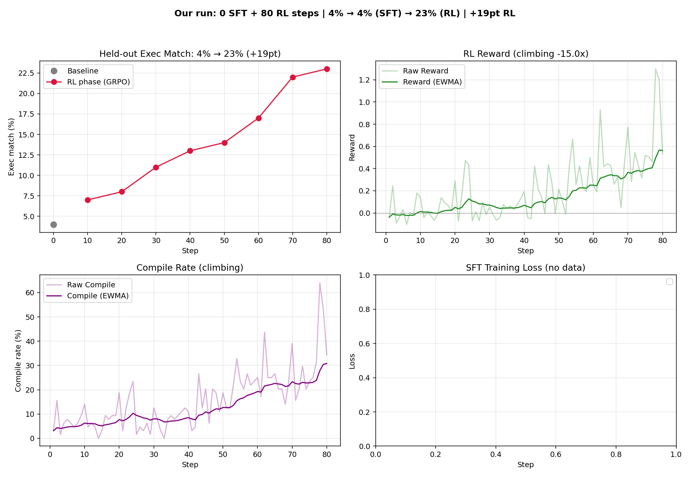

# Text-to-SQL RL

Gemma 4 Text-to-SQL SFT+RL recipe. This directory is self-contained: the
training loop, dataset formatting, SQL rewards, plotting utility, and reference
results all live here.

## Contents

* `texttosql_sft_grpo.py`: Gemma 4 SFT+RL training script.
* `utils/helpers.py`: Server check, tokenization, and batching helpers.
* `utils/rewards.py`: Dataset loading, SQL execution, and reward helpers.
* `utils/plot.py`: Metrics plotter for recipe curves.
* `results/`: Reference plots from known-good runs.

## Known-Good Config

- Dataset: `philschmid/gretel-synthetic-text-to-sql`
- Model: `google/gemma-4-e2b`
- Sampler: vLLM `0.19.1`, no Open-RL BOS prepend shim
- Preset: `gemma4_e2b_rl_recipe`
- Seed: `42`
- SFT: `5` steps, `100` examples, lr `5e-5`
- RL: `80` steps, `8` prompts x `8` samples per step, lr `5e-6`
- Reward: compile `0.25`, match `2.0`, error penalty `-0.25`, similarity blend `1.0`
- Eval: `100` held-out examples with executable, non-empty target rows

Latest clean run:

```text
baseline exec:  8%
after SFT:     12%
after RL:      40%
RL gain:      +28pt

baseline exact: 4%
after SFT:     6%
after RL:     10%
```

The script writes metrics and logs under:

```text
examples/rl/text-to-sql/artifacts/texttosql_sft_grpo_<preset>_<phase>/
```

For the default full known-good preset, that is:

```text
examples/rl/text-to-sql/artifacts/texttosql_sft_grpo_gemma4_e2b_rl_recipe_full/
```

## Setup

Use two CUDA GPUs so the sampler and gateway can run separately. The known-good
setup uses NVIDIA L4-class GPUs or larger, with at least 24 GB per GPU. Larger
GCE GPU machines such as A3 or A4 are also suitable; see the
[GCE GPU VM docs](https://docs.cloud.google.com/compute/docs/gpus/create-gpu-vm-a3u-a4)
for provisioning examples.

Install `uv` if needed:

```bash
curl -LsSf https://astral.sh/uv/install.sh | sh
```

Patch vLLM for Gemma 4 LoRA support. This is a temporary local patch for
duplicate LoRA module registration, related to
[vllm-project/vllm#39246](https://github.com/vllm-project/vllm/issues/39246).

```bash
cd src/server
uv run --extra vllm python scripts/patch_vllm_lora_dedup.py
```

Start the vLLM sampler on GPU 0:

```bash
CUDA_VISIBLE_DEVICES=0 VLLM_ARCHITECTURE_OVERRIDE=Gemma4ForCausalLM make vllm BASE_MODEL=google/gemma-4-e2b
```

Start the Open-RL gateway and trainer on GPU 1:

```bash
CUDA_VISIBLE_DEVICES=1 make server BASE_MODEL=google/gemma-4-e2b SAMPLER=vllm
```

## Run

RL only:

```bash
cd examples/rl/text-to-sql
TINKER_BASE_URL=http://127.0.0.1:9003 TINKER_API_KEY=tml-dummy uv run python texttosql_sft_grpo.py gemma4_e2b_rl_recipe phase=rl_only
```

Full SFT + RL:

```bash
cd examples/rl/text-to-sql
TINKER_BASE_URL=http://127.0.0.1:9003 TINKER_API_KEY=tml-dummy uv run python texttosql_sft_grpo.py gemma4_e2b_rl_recipe
```

RL only from a specific SFT adapter:

```bash
cd examples/rl/text-to-sql
TINKER_BASE_URL=http://127.0.0.1:9003 TINKER_API_KEY=tml-dummy uv run python texttosql_sft_grpo.py gemma4_e2b_rl_recipe phase=rl_only sft_adapter_name=your-sft-adapter-name
```

Useful CLI overrides:

```text
sft.steps=5
sft.learning_rate=5e-5
dataset.train_limit=100
rl.steps=80
rl.loss_fn=ppo
rl.kl_coeff=0.1
rl.clip_range=0.2
rl.learning_rate=5e-6
rl.prompts_per_step=8
rl.samples_per_prompt=8
dataset.rl_train_limit=5000
dataset.eval_limit=100
```

## Plot

```bash
cd examples/rl/text-to-sql
uv run python -m utils.plot artifacts/texttosql_sft_grpo_gemma4_e2b_rl_recipe_full/metrics.jsonl
```

For `phase=rl_only`, replace `_full/metrics.jsonl` with
`_rl_only/metrics.jsonl`. For `phase=sft_only`, use `_sft_only/metrics.jsonl`.
The plot is written to `curves.png` in the same artifact directory as the
metrics file unless you pass an output path as the second argument.

The plotter renders held-out execution match, RL reward EWMA, compile-rate EWMA,
and SFT loss.

## Clean State

Adapters and checkpoints are reused by name, so clear state when comparing
recipes:

```bash
rm -rf examples/rl/text-to-sql/artifacts/texttosql_sft_grpo_gemma4_e2b_rl_recipe_full
rm -f /tmp/open-rl/checkpoints/gemma4_e2b_rl_recipe-*
rm -rf /tmp/open-rl/peft/*
```

Use the PEFT wipe only when you want to remove every cached LoRA adapter.

## What To Expect

```text
baseline eval @ step 0:
execution_match=8%, exact_match=4%, similarity=0.372

SFT eval @ step 5:
execution_match=12%, exact_match=6%, similarity=0.494
```

Example before/after SFT:

```text
Question:
What is the total weight of all shipments in the 'Beijing' warehouse?

Base response:
question: what is the total weight of all shipments in the 'beijing' warehouse? sql: ...

After 5 SFT steps:
select sum(weight) from shipment where warehouse_id = 1

Target:
select sum(weight) from shipment s join warehouse w
on s.warehouse_id = w.id where w.city = 'beijing'
```

RL only, starting from a fresh LoRA:



Full SFT + RL:


## Chat With the Model

After training, keep the Open-RL gateway running and use the dev CLI:

```bash
make cli list
make cli chat --model <model_id>
```

For more CLI options, see [`dev/tools`](../../../dev/tools#2-chat-with-an-adapter).
