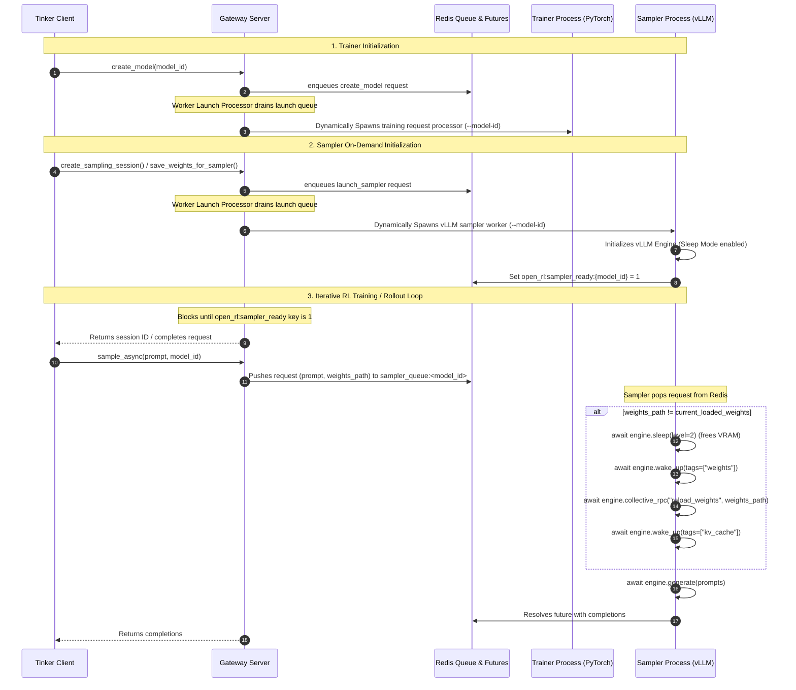
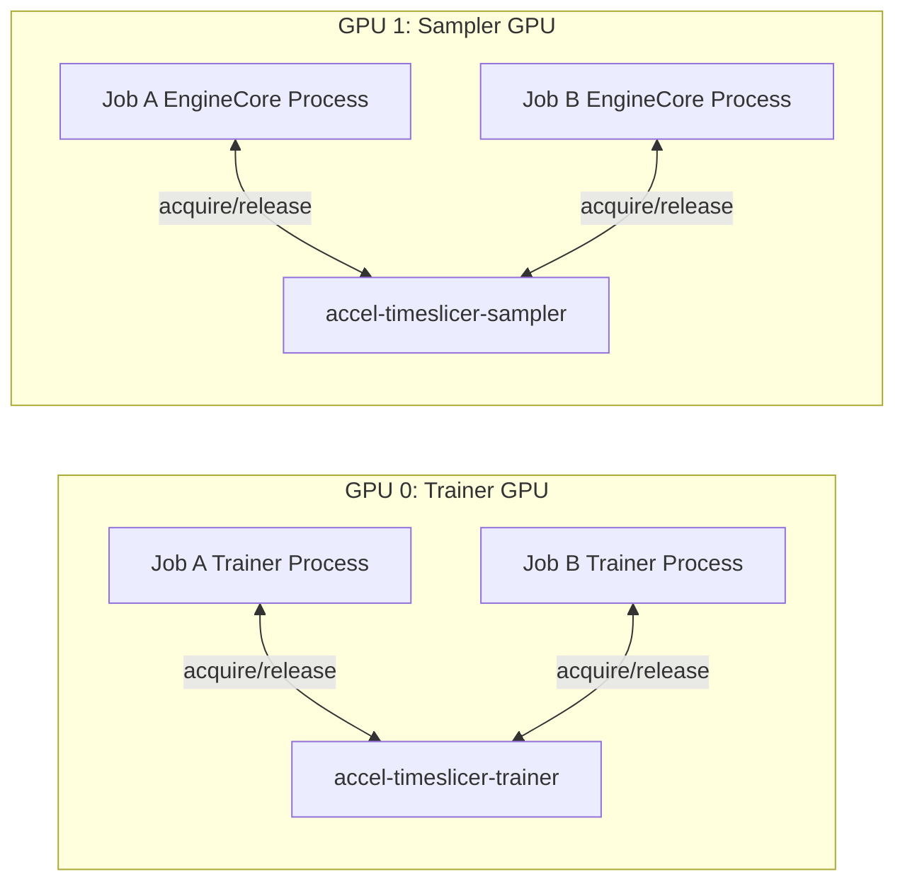

# Full Fine-Tuning (FFT) Dynamic Sampler & Weight Swapping

This document describes the design, architecture, and implementation of the dynamic weight-reloading sampler loop for Full Fine-Tuning (FFT) Reinforcement Learning (RL) in the Open-RL framework.

---

## 1. Context & Key Challenge
In Reinforcement Learning, the training loop alternates continuously between:
1. **Sampling**: Generating completions (rollouts) using the current model weights.
2. **Training**: Updating the model weights using the collected rollouts.

For **LoRA**, vLLM natively supports dynamic adapter loading at runtime (via Multi-LoRA). 
For **Full Fine-Tuning (FFT)**, the entire base model weights are modified. vLLM does not natively support changing the base model architecture/weights dynamically during active inference. 

To run both PyTorch FSDP training and high-throughput vLLM inference on resource-constrained hardware (e.g. sharing a single GPU, or running on separate GPUs), we utilize **vLLM Sleep Mode** (Level 2 Sleep) and **Redis Queue-Based Pull Sampling** to perform fast, in-place base weights reloading without restarting the sampler engine.

---

## 2. Architecture: Queue-Based Pull Model

Open-RL uses a **decoupled, queue-based pull architecture** to coordinate gateway requests, PyTorch training, and vLLM sampling. 

### Sequence Diagram:


---

## 3. Key Components

### 1. Redis Request Store (`src/server/store.py`)
Provides list-based queueing for sampling requests to decouple the API gateway from sampler processes:
- `put_sampling_request(req_data)`: Pushes a serialization of sampling prompts, constraints, and target `weights_path` onto `open_rl:sampler_queue:<model_id>`.
- `get_sampling_requests_for_model(model_id)`: Drains the queue in batches and passes them to the sampler worker.

### 2. API Gateway (`src/server/gateway.py`)
- `/api/v1/create_sampling_session`: Resolves the active model ID and blocks requests until the dynamically spawned sampler worker registers itself as ready in Redis.
- `/api/v1/asample`: Resolves Tinker sequence/session IDs (e.g. `tinker://model-id/sampler_weights/sampler-seq`) to absolute local directories under `/tmp/open-rl/sampler_full/`. It packages the target directory as `weights_path` and enqueues the request to Redis.

### 3. Worker Launcher & Compatibility (`src/server/worker_launch_processor.py` & `scripts/run_training_e2e.py`)
- **FFT Mode**: Trainer and sampler processes are launched dynamically on demand:
  - Spawns Trainer: `python -m server.training_requests_processor --model-id <model_id>` (triggered during `create_model`).
  - Spawns Sampler: `python -m server.vllm_sampler --model-id <model_id>` (triggered during `create_sampling_session` / `save_weights_for_sampler`, overriding `CUDA_VISIBLE_DEVICES` using `SAMPLER_CUDA_VISIBLE_DEVICES`).
- **LoRA Mode**: The sampler worker is launched statically on startup with `--model-id <base_model_name>` and drains the corresponding queue directly.
- **Readiness Checks**: The launcher uses a raw socket Redis client wrapper (`redis_key_ready`) to verify when a statically launched sampler has completed startup/compilation.

### 4. Dynamic Sampler Worker (`src/server/vllm_sampler.py`)
Runs a headless pull-mode loop:
- Initializes the AsyncLLMEngine.
- Blocks until requests are pushed to `open_rl:sampler_queue:<model_id>`.
- Drains the queue in batches and executes them concurrently using `asyncio.gather(*tasks)`. This allows vLLM to internally batch concurrent rollout requests for maximum hardware utilization.
- Uses a local `reload_lock = asyncio.Lock()` to handle weights reloading safely:
  - If multiple concurrent requests are popped, they check if `weights_path` matches the loaded model.
  - The first task to acquire the lock will perform the sleep-wake-reload loop if a weights change is detected:
    1. Calls `engine.sleep(level=2)` to discard active weights and KV caches, releasing ~85% of GPU memory.
    2. Calls `engine.wake_up(tags=["weights"])` to allocate memory for the new checkpoint.
    3. Calls `engine.collective_rpc("reload_weights")` to load safetensors in-place.
    4. Calls `engine.wake_up(tags=["kv_cache"])` to initialize a clean KV cache pool.
  - Subsequent concurrent tasks with matching paths bypass reloading immediately once the lock is released.
- Feeds token ids into `engine.generate()` and pushes completions to the future's Redis channel.

---

## 4. Key Performance Characteristics

Measurements captured during end-to-end training runs using `Qwen2.5-0.5B` on NVIDIA L4 GPUs:
- **Sleep Memory Release**: Freeing `27+ GiB` of VRAM is nearly instantaneous.
- **Weights Allocation**: `~0.05 seconds`.
- **In-place weights reload (disk to VRAM)**: `~0.80 seconds` for a `0.92 GiB` model checkpoint.
- **KV Cache Allocation**: `~0.67 seconds`.
- **Total Weights Swap Latency**: **`~1.5 seconds`** in the active RL training loop.

---

## 5. Sharing vs. Dedicated Sampler Workers: Inter-Job Turn Taking

When running multiple concurrent RL jobs ($N > 2$) sharing node resources, both training and sampling processes must coordinate their access to their respective GPUs to avoid VRAM conflicts. 

### Symmetric Turn-Taking Architecture
To support concurrent jobs, the Open-RL system boots two separate, isolated Accelerator Time-Slicer daemons (which layer over physical snapshot backends):
1. **`accel-timeslicer-trainer`** (socket: `accel-timeslicer-trainer.sock`): Manages and time-slices GPU 0 (the training GPU).
2. **`accel-timeslicer-sampler`** (socket: `accel-timeslicer-sampler.sock`): Manages and time-slices GPU 1 (the sampling GPU).



#### Rationale for Separate Accelerator Time-Slicer Instances
Running two separate time-slicer daemons (trainer and sampler) provides two vital benefits:
1. **Independent Preemption Locking (GPU Concurrency)**: The time-slicer operates on a single global preemption lock per instance. If we shared a single agent instance, acquiring the lock to train on GPU 0 would block sampler processes from running on GPU 1. Isolating the daemons ensures training and sampling locks do not interfere, enabling parallel training-rollout overlaps between Job A and Job B.
2. **CUDA Device Context Isolation**: Trainer processes run with `CUDA_VISIBLE_DEVICES=0` while samplers run with `CUDA_VISIBLE_DEVICES=1`. Inside their respective processes, both refer to their active GPU as index `0`. Separate daemons cleanly align lock requests with the target physical GPUs without device collisions.

### Option A: Single Shared vLLM Instance
A single `vllm-worker` process runs on the GPU. It pulls requests sequentially from Redis and checks `weights_path`. If Job A and Job B both submit requests, it swaps weights back and forth:
- **Pros**:
  - **Memory (RAM) Efficiency**: The model weights are loaded into CPU memory only once. Excellent for large models (13B+) where running multiple instances would exhaust host RAM.
- **Cons**:
  - **I/O Latency**: Every swap requires reading safetensors from the network filesystem and compiling. Swapping takes **`~1.5 seconds`** on every step.

### Option B: Dedicated vLLM Instance Per Job (IMPLEMENTED)
Each job launches its own dedicated `vllm_sampler` process (each listening to its own `sampler_queue:<model_id>`). Both processes share GPU 1. To share the GPU transparently, they take turns using `accel-timeslicer-sampler`:
- **Parent Proxying**: The parent `vllm_sampler` process runs on CPU and resolves the PID of its child `EngineCore` process (which holds all CUDA contexts).
- **Coordinated Engine Initialization (Lock Transfer)**:
  - During engine startup (`from_engine_args`), vLLM allocates the KV cache and warms up CUDA graphs (which requires exclusive GPU access and allocates up to 70% VRAM).
  - To prevent concurrent workers from initializing at the same time and causing OOMs on startup, the workers serialize their warmups using a coordinated lock transfer:
    1. The parent `vllm_sampler` process registers its parent PID with the Accelerator Time-Slicer and acquires the GPU lock.
    2. Under the parent lock, it calls `init_engine()` safely.
    3. Once initialized, it resolves the child `EngineCore` process PID and registers it.
    4. To prevent other waiting processes from stealing the GPU lock before the newly spawned child can be checkpointed, the worker calls `TRANSFER_LOCK` to transfer ownership of the active GPU lock from the parent PID to the child PID.
    5. The parent process safely releases its acquire context (treated as a successful no-op on the daemon since the lock was transferred).
    6. Finally, the worker calls `RELEASE` on the child PID, which checkpoints the child (freeing its GPU VRAM from 70% to ~0 MiB) and releases the GPU lock to the next waiting worker.
- **GPU Checkpoint/Restore (with VRAM Pre-release)**:
  - When Job A needs to generate rollouts, its parent sampler process calls `acquire(EngineCoreA_PID)` via `accel-timeslicer-sampler.sock`. This checkpoints Job B's `EngineCore` process and restores Job A's `EngineCore` process.
  - **Optimization**: Once the batch of sampling requests completes, but **before** releasing the GPU lock, the sampler calls `await engine.sleep(level=2)`. This releases Job A's active weights and KV caches from the GPU (reducing its VRAM usage to ~0 MiB).
  - Consequently, when the backend executes `cuda-checkpoint` on the process, there is almost no memory to copy, dropping checkpoint latency from **`~14 seconds`** to **`~0.5 seconds`** (a 28x speedup).
- **Pros**:
  - **Fast Wake Up & Checkpoint**: Checkpointing is near-instantaneous (~0.5s). Waking up the engine on restore only requires copying weights from CPU RAM back to GPU VRAM, taking only **`~0.7 seconds`** (no disk I/O).
- **Cons**:
  - **RAM Overhead**: Each inactive instance holds a full copy of the model weights in CPU RAM. High risk of system OOMs on large models.

### Recommendation Grid:
- **Small/Medium Models (up to ~8B)**: Use **Option B (Dedicated Instances)** to gain a 2x latency benefit during step switches.
- **Large Models (13B+)**: Use **Option A (Shared Instance)** to maintain host memory stability.
- **Heterogeneous Architectures (e.g. Qwen + Gemma)**: **Must** use **Option B** (separate processes), as a single instance cannot reload between different configuration shapes.

---

## 6. Out-of-Order / Parallel Sampling of Different Weight Versions

If a client (or multiple clients sharing an instance) submits concurrent sampling requests for **different** weights versions (e.g. Request A for `sampler-1` and Request B for `sampler-2` simultaneously):

1. **Serialized Swapping (Thrashing)**: If they are processed sequentially, the worker will successfully process both but will thrash back and forth, triggering a full `sleep -> wake -> reload -> wake` cycle on every step transition, which adds `~1.5 seconds` of latency overhead per swap.
2. **Cancellation on Active Generations**: If Request B (triggering a reload to `sampler-2`) starts executing *concurrently* (via `asyncio.gather`) while Request A (using `sampler-1`) is still generating tokens inside vLLM:
   - Request B will acquire the reload lock and call `engine.sleep(level=2)`.
   - vLLM's `sleep` call immediately cancels all active generations and frees memory.
   - Request A's running generation will be interrupted and fail with a `RequestFailedResponse` (e.g., EngineDeadError or cancellation exception).
   - Request B's generation will succeed.
   
*Note: In normal GRPO/PPO RL training, the training loop is strictly synchronous (all rollouts for the current policy weights are collected and completed before the trainer updates weights for the next step). Therefore, parallel execution of different weight versions does not occur within a single job context. For multi-job contexts, **Option B (Dedicated Instances)** should be used to isolate environments.*

---

## 7. Configuration & Environment Variables

To configure and run disaggregated GPU training/sampling:

| Environment Variable | Description |
| :--- | :--- |
| `OPEN_RL_ENABLE_FFT=true` | Configures the framework, gateway, and vLLM sampler to run in Full Fine-Tuning mode. |
| `SAMPLING_BACKEND=vllm` | Sets the sampling engine to vLLM (defaults to PyTorch/Torch if unset). |
| `CUDA_VISIBLE_DEVICES=0` | Sets the GPU visibility for the PyTorch trainer (bound to the gateway process). |
| `SAMPLER_CUDA_VISIBLE_DEVICES=1` | Sets the GPU visibility for the dynamic vLLM sampler subprocess. |
| `VLLM_GPU_MEMORY_UTILIZATION=0.70` | Allocates VRAM bounds for the sampler engine. |

### Running the End-to-End Suite:
To run a single FFT RL job in vLLM mode:
```bash
make test e2e tiny-fft-rl TRAINING_TEST_ARGS="sampling_backend=vllm trainer_gpu=0 sampler_gpu=1 steps=10"
```
To run two concurrent FFT RL jobs sharing both trainer and sampler GPUs via Accelerator Time-Slicer preemption:
```bash
make test e2e tiny-fft-rl-x2 TRAINING_TEST_ARGS="sampling_backend=vllm trainer_gpu=0 sampler_gpu=1 steps=5"
```

---

## 8. Session-ID and Weight Versioning

In Open-RL, the `sampling_session_id` acts as a versioned weight reference that pins sampling requests to a specific iteration of the policy weights.

### How it Works:
1. **Weight Generation & Versioning**:
   - The trainer calls `trainer.save_weights_for_sampler(name=alias)`.
   - The request runs through the queue to ensure prior training steps are complete.
   - The trainer writes the model weights to a versioned folder and registers a tinker URI: `tinker://<model_id>/sampler_weights/<alias>` (where `<alias>` contains a sequence number or timestamp).
2. **Session Creation**:
   - The client calls `create_sampling_client(weights_path)` passing the versioned `tinker://` URI.
   - The gateway's `/api/v1/create_sampling_session` validates the model path, blocks until the model's dynamic sampler worker registers as ready in Redis, and returns the URI as the `sampling_session_id`.
3. **Session Pinning during Sampling**:
   - When the client requests generation, it calls `sample_async(prompt)` on the returned client, which sends a request to `/api/v1/asample` with the pinned `sampling_session_id`.
   - The gateway extracts the relative path portion of the `tinker://` URI and resolves it to the absolute local directory: `/tmp/open-rl/sampler_full/<model_id>/sampler_weights/<alias>`.
   - It packages this absolute path into the `weights_path` field of the sampling request payload and enqueues it to `open_rl:sampler_queue:<model_id>`.
   - The sampler worker pops the request, compares the target `weights_path` to its currently loaded weights directory, and triggers a sleep-reload cycle if a change is detected. This ensures that the generated tokens are always sampled from the exact version of the policy weights corresponding to that session.

---

## 9. Control Plane & Data Plane Decoupling (Lifecycle Management)

The framework segregates operations into **Control Plane** (infrastructure, worker lifecycles, configuration) and **Data Plane** (training metrics, token sampling) to enable asynchronous execution, fail-safe scaling, and zero-drop request drainage.

```
[Control Plane Operations]
Gateway Control Queue (open_rl:worker_launch_queue) ---> WorkerLaunchProcessor (launches/gracefully stops PIDs)

[Data Plane Operations]
Gateway Data Queues (queue:<model_id>, sampler_queue:<model_id>) ---> Workers (runs steps/computes tokens)
```

### 1. Queue Division & Protocols

| Plane | Operation | Protocol / Redis Key | Consumer |
| :--- | :--- | :--- | :--- |
| **Control Plane** | `create_model` (Launch trainer) | `open_rl:worker_launch_queue` (Central) | `WorkerLaunchProcessor` |
| **Control Plane** | `launch_sampler` (Launch sampler) | `open_rl:worker_launch_queue` (Central) | `WorkerLaunchProcessor` |
| **Control Plane** | `delete_model` (Stop workers) | `open_rl:worker_launch_queue` (Central) | `WorkerLaunchProcessor` |
| **Control Plane** | `create_sampling_session` | Registry Metadata Key (Redis) | Gateway |
| **Data Plane** | `forward_backward`, `optim_step` | `open_rl:queue:<model_id>` (Isolated) | PyTorch Trainer |
| **Data Plane** | `save_weights_for_sampler`, `save_state` | `open_rl:queue:<model_id>` (Isolated) | PyTorch Trainer |
| **Data Plane** | `sample`, `asample` | `open_rl:sampler_queue:<model_id>` (Isolated) | vLLM Sampler |

---

### 2. Provisioning & Activation (Control Plane)
- **Trainer Provisioning**: When a client initializes a model via `/api/v1/create_model`, the gateway enqueues a `create_model` command to `open_rl:worker_launch_queue`. The `WorkerLaunchProcessor` daemon pops the request and invokes `FFTWorkerManager.launch_trainer(model_id)` to spawn the dedicated PyTorch trainer subprocess.
- **Sampler Provisioning**: When a client initializes a sampling session via `/api/v1/create_sampling_session` (or saves weights for sampling via `/api/v1/save_weights_for_sampler`), the gateway enqueues a `launch_sampler` command to `open_rl:worker_launch_queue`. The processor pops it and invokes `FFTWorkerManager.launch_sampler(model_id)` to spawn the dedicated vLLM sampler worker (if not already running).
- **Readiness**: The sampler worker compiles CUDA graphs and writes `open_rl:sampler_ready:<model_id> = "1"`. The gateway blocks and polls this key, returning the versioned `session_id` to the client only when ready.

---

### 3. Graceful Queue-Based Teardown (Implemented)
To prevent dropping in-flight sampling or optimization steps, de-provisioning is fully queue-decoupled using the **Sentinel Pattern**:

1. **Teardown Trigger**: When a client completes training, it sends a `POST` request to the Gateway's `/api/v1/delete_model` endpoint.
2. **Sentinel Enqueueing**: Instead of hard-killing processes, the Gateway writes a `shutdown_workers` control command to `open_rl:worker_launch_queue`.
3. **Control-to-Data Signaling**: The `WorkerLaunchProcessor` pops the command and enqueues a **Shutdown Sentinel (Poison Pill)** (`{"request_id": "SHUTDOWN_SENTINEL"}`) to the tails of both the trainer (`open_rl:queue:<model_id>`) and sampler (`open_rl:sampler_queue:<model_id>`) FIFO data queues.
4. **FIFO Request Drainage**:
   - The workers continue to pop and process all pending requests in their queues.
   - When a worker pops the sentinel, it halts polling, awaits any active asyncio tasks (token generation or backward steps), unregisters its PID from the Accelerator Time-Slicer, and exits gracefully.
5. **Background Process Reaping**:
   - `FFTWorkerManager` runs a non-blocking background task to monitor the spawned PIDs.
   - If they exit cleanly, it clears them from the registry. If they fail to exit within a grace period (e.g. 30 seconds), it falls back to a hard `terminate()` to reclaim resources.
6. **Time-Slicer Resiliency**:
   - The Accelerator Time-Slicer (`serve.py`) checks PID liveness before/during preemption tasks. Dead or zombie processes are skipped gracefully, and socket closure automatically cleans up daemon state.

---

### 4. Proposed De-provisioning (Idle Timeout)
To clean up stale workers in the event of hard client VM crashes or unhandled script kills:

- **Server-Side Idle Timeout**:
  - The `WorkerLaunchProcessor` daemon monitors active tenant activity.
  - If a tenant's data queue has been idle (no requests popped/enqueued) for a configurable timeout (e.g. 10 minutes), the processor automatically triggers the sentinel shutdown flow for that `model_id`.
  - If the client subsequently resumes training, the processor detects the missing workers and dynamically re-provisions them transparently.
  - This ensures maximum robustness against crash-induced leaks without requiring client-side handlers.

---

## 10. Accelerator Time-Slicer Integration & Lock Management

To coordinate GPU sharing, workers communicate with local Accelerator Time-Slicer instances via UNIX domain sockets:
- `accel-timeslicer-trainer.sock` (manages GPU 0 for trainers)
- `accel-timeslicer-sampler.sock` (manages GPU 1 for samplers)

### 1. Lock Management & API Command Set
The Snapshot Agent daemon supports the following JSON-based socket interface commands:
- `REGISTER`: Registers a process PID to participate in scheduling.
- `UNREGISTER`: Removes a process PID and cleans up its lock allocations.
- `ACQUIRE`: Requests the global preemption lock for a PID. Blocks until the lock is acquired, and automatically suspends the active running process.
- `RELEASE`: Signals that a process is yielding its GPU lock, triggering an immediate checkpoint snapshot.
- `TRANSFER_LOCK`: Moves the ownership of an active lock from one PID to another atomically.

---

### 2. Architectural Requirement for the `TRANSFER_LOCK` Primitive

During full fine-tuning rollouts, the vLLM sampler worker must serialize its engine startup to prevent CUDA Out of Memory (OOM) errors during CUDA graph warmups (which consume up to 70% VRAM). This is achieved through the coordinated parent-to-child lock transfer sequence:

1. **Process Tree & CUDA Context Separation**:
   - vLLM splits the sampler into a Python **parent process** (managing queues/IPC) and a dynamically spawned **child process** (`EngineCore` / `ModelExecutor`).
   - The actual CUDA driver context and VRAM footprint reside entirely inside the child process.
   - The utility `cuda-checkpoint` operates strictly on a **single target PID** (using direct POSIX real-time signals) and is not aware of the process tree. Thus, checkpointing/restoring must target the child process directly to reclaim/restore VRAM.

2. **The Startup OOM Race Condition**:
   - Because the child process PID is dynamically allocated during engine creation, the worker cannot know its PID beforehand.
   - To serialize the initialization phase and prevent multiple samplers from compiling graphs simultaneously (which causes a CUDA OOM), the parent process must proxy the lock:
     - The **parent** acquires the Accelerator Time-Slicer lock.
     - The parent initializes the vLLM engine, which spawns the child process.
     - The parent registers the child PID with the Accelerator Time-Slicer.

3. **Why We Must "Transfer" Instead of "Release"**:
   - If the parent released its lock using standard context managers immediately after initialization, a waiting concurrent worker would instantly acquire the lock and begin its graph warmups.
   - At this moment, the first worker's child process is still running in memory because the physical snapshot backend has not yet checkpointed it (checkpointing is triggered asynchronously on release or preemption).
   - This leads to two active engines compiling graphs at the same time, causing a CUDA OOM.
   - **The Solution**: The parent calls **`TRANSFER_LOCK`** to transfer ownership of the active lock to the child process PID *before* exiting its code block. This keeps the GPU lock continuously active, blocking other workers until the child process is explicitly checkpointed (`RELEASE` command) to release its VRAM down to 0 MiB.

